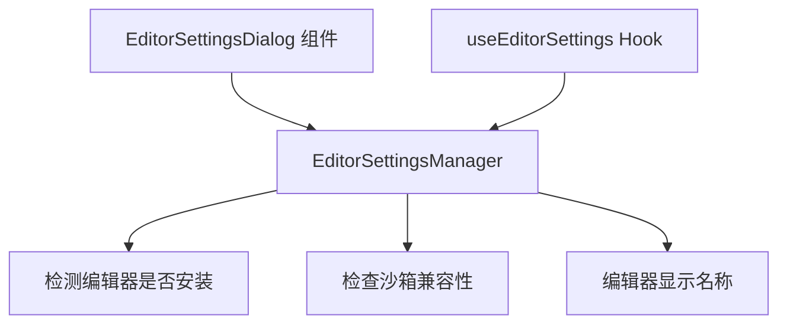

# editors 架构

> 外部编辑器设置管理，检测和列出可用的代码编辑器

## 概述

`editors` 目录包含外部编辑器的设置管理逻辑。`EditorSettingsManager` 单例负责检测系统上安装的编辑器（VS Code、Vim、Nano 等），并考虑沙箱环境的限制，为编辑器选择对话框提供可用编辑器列表。

## 架构图



## 目录结构

```
editors/
└── editorSettingsManager.ts  # 编辑器设置管理器
```

## 关键文件

| 文件 | 功能 |
|------|------|
| `editorSettingsManager.ts` | `EditorSettingsManager` 类，构造时枚举所有支持的编辑器类型，检查每个编辑器是否已安装且在沙箱中可用，导出单例 `editorSettingsManager` |

## 内部依赖

无直接内部依赖。

## 外部依赖

| 包名 | 用途 |
|------|------|
| `@google/gemini-cli-core` | EditorType、EDITOR_DISPLAY_NAMES、hasValidEditorCommand、allowEditorTypeInSandbox |
