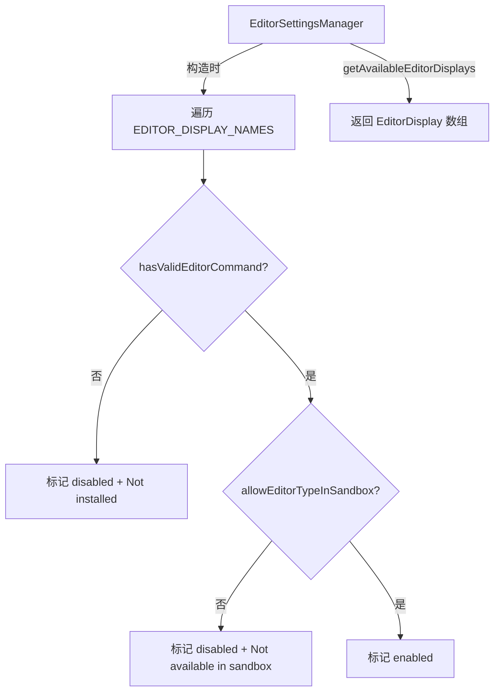

# editorSettingsManager.ts

> 管理可用外部编辑器列表，检测编辑器安装状态和沙箱兼容性

## 概述

`editorSettingsManager.ts` 提供一个 `EditorSettingsManager` 单例类，用于枚举系统中所有支持的外部编辑器（如 VS Code、Vim、Nano 等），并检测每个编辑器是否已安装以及是否可在沙箱环境中使用。它为设置界面中的编辑器选择列表提供数据源。

## 架构图（mermaid）

## 主要导出

| 名称 | 类型 | 说明 |
|------|------|------|
| `EditorDisplay` | `interface` | 编辑器显示信息：`name` (显示名)、`type` (类型或 `'not_set'`)、`disabled` (是否不可用) |
| `editorSettingsManager` | `EditorSettingsManager` | 单例实例，提供 `getAvailableEditorDisplays()` 方法 |

## 核心逻辑

1. 构造函数中遍历所有 `EDITOR_DISPLAY_NAMES` 中注册的编辑器类型（已排序）
2. 对每个编辑器执行两项检查：
   - `hasValidEditorCommand(type)` — 检测编辑器命令是否存在
   - `allowEditorTypeInSandbox(type)` — 检测编辑器是否允许在沙箱中运行
3. 始终在列表开头插入 "None"（`type: 'not_set'`）选项
4. 不可用的编辑器在名称后追加标签说明原因

## 内部依赖

无

## 外部依赖

| 模块 | 用途 |
|------|------|
| `@google/gemini-cli-core` | `allowEditorTypeInSandbox`, `hasValidEditorCommand`, `EditorType`, `EDITOR_DISPLAY_NAMES` |
