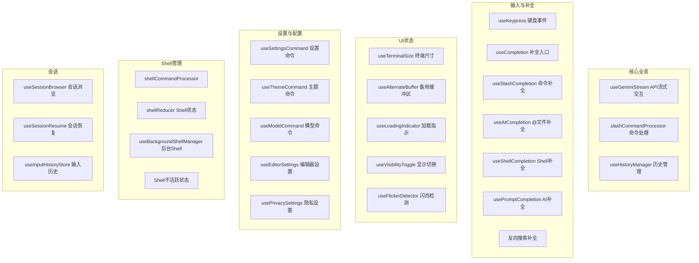

# hooks 架构

> 自定义 React Hooks 集合，封装 Gemini CLI 的核心业务逻辑和 UI 交互

## 概述

`hooks` 目录包含 60+ 个自定义 React Hooks，是 Gemini CLI UI 层最大的逻辑模块。这些 Hooks 封装了从 Gemini API 流式交互、命令处理、历史管理、输入补全、键盘处理到 Shell 管理等各方面的业务逻辑。它们被 AppContainer 和各组件调用，实现了逻辑与展示的分离。

## 架构图



## 目录结构

```
hooks/
├── shell-completions/          # Shell 命令补全提供器
├── useGeminiStream.ts          # Gemini API 流式交互核心
├── slashCommandProcessor.ts    # 斜杠命令处理器
├── atCommandProcessor.ts       # @命令处理器（文件引用）
├── shellCommandProcessor.ts    # Shell 命令处理器
├── shellReducer.ts             # Shell 状态 reducer
├── useHistoryManager.ts        # 历史记录管理
├── useKeypress.ts              # 键盘事件处理
├── useKeyMatchers.tsx          # 键绑定匹配 Hook
├── useCompletion.ts            # 补全入口
├── useSlashCompletion.ts       # 斜杠命令补全
├── useAtCompletion.ts          # @文件补全
├── useShellCompletion.ts       # Shell Tab 补全
├── useCommandCompletion.tsx    # 命令补全
├── usePromptCompletion.ts      # AI 提示补全
├── useReverseSearchCompletion.tsx # Ctrl+R 反向搜索
├── useInputHistory.ts          # 上下箭头输入历史
├── useInputHistoryStore.ts     # 输入历史存储
├── useTerminalSize.ts          # 终端尺寸监听
├── useAlternateBuffer.ts       # 备用屏幕缓冲区
├── useLoadingIndicator.ts      # 加载指示器逻辑
├── usePhraseCycler.ts          # 短语循环器
├── useTips.ts                  # 提示信息
├── useFlickerDetector.ts       # UI 闪烁检测
├── useThemeCommand.ts          # 主题命令逻辑
├── useTerminalTheme.ts         # 终端背景颜色检测和主题自动切换
├── useModelCommand.ts          # 模型命令逻辑
├── useSettingsCommand.ts       # 设置命令逻辑
├── useEditorSettings.ts        # 编辑器设置逻辑
├── usePrivacySettings.ts       # 隐私设置逻辑
├── useQuotaAndFallback.ts      # 配额和降级逻辑
├── useFolderTrust.ts           # 文件夹信任逻辑
├── useIncludeDirsTrust.tsx     # 包含目录信任
├── useIdeTrustListener.ts      # IDE 信任监听
├── usePermissionsModifyTrust.ts # 权限修改信任
├── useMcpStatus.ts             # MCP 服务器状态
├── useExtensionUpdates.ts      # 扩展更新管理
├── useExtensionRegistry.ts     # 扩展注册表
├── useRegistrySearch.ts        # 注册表搜索
├── useSessionBrowser.ts        # 会话浏览器逻辑
├── useSessionResume.ts         # 会话恢复逻辑
├── useMessageQueue.ts          # 消息队列管理
├── useBackgroundShellManager.ts # 后台 Shell 管理
├── useShellInactivityStatus.ts # Shell 不活跃状态检测
├── useConsoleMessages.ts       # 控制台消息收集
├── useMemoryMonitor.ts         # 内存使用监控
├── useLogger.ts                # 日志记录
├── useGitBranchName.ts         # Git 分支名获取
├── useFocus.ts                 # 终端焦点检测
├── useMouse.ts                 # 鼠标事件
├── useMouseClick.ts            # 鼠标点击
├── useSuspend.ts               # 进程挂起
├── useTimer.ts                 # 计时器
├── useTimedMessage.ts          # 定时消息
├── useInactivityTimer.ts       # 不活跃计时器
├── useRepeatedKeyPress.ts      # 重复按键检测
├── useStateAndRef.ts           # state + ref 组合
├── useVisibilityToggle.ts      # 显示/隐藏切换
├── useSelectionList.ts         # 列表选择逻辑
├── useTabbedNavigation.ts      # Tab 页导航
├── useSettingsNavigation.ts    # 设置导航
├── useSnowfall.ts              # 雪花动画
├── useApprovalModeIndicator.ts # 审批模式指示
├── useConfirmingTool.ts        # 工具确认
├── useHookDisplayState.ts      # Hook 显示状态
├── useRunEventNotifications.ts # 运行事件通知
├── useToolScheduler.ts         # 工具调度
├── useBanner.ts                # 横幅管理
├── useRewind.ts                # 回退功能
├── useSearchBuffer.ts          # 搜索缓冲区
├── useAnimatedScrollbar.ts     # 动画滚动条
├── useBatchedScroll.ts         # 批量滚动
├── useInlineEditBuffer.ts      # 内联编辑缓冲区
├── useShellHistory.ts          # Shell 历史
├── vim.ts                      # Vim 模式集成
├── toolMapping.ts              # 工具名称映射
└── creditsFlowHandler.ts       # 信用额度处理
```

## 关键文件

| 文件 | 功能 |
|------|------|
| `useGeminiStream.ts` | 核心 Hook，管理与 Gemini API 的流式交互，处理工具调用、思考过程、错误恢复 |
| `slashCommandProcessor.ts` | 斜杠命令注册和调度，支持子命令、确认请求、Agent 和 MCP 命令 |
| `useHistoryManager.ts` | 对话历史管理，支持添加、清除、加载历史记录 |
| `useKeypress.ts` | 键盘事件 Hook 的消费端，提供优先级注册和激活控制 |
| `useCompletion.ts` | 补全入口，协调 slash/at/shell/AI/反向搜索等多种补全源 |
| `useTerminalSize.ts` | 终端尺寸监听，响应窗口大小变化 |
| `useQuotaAndFallback.ts` | 处理配额超限和模型降级逻辑 |

## 内部依赖

- `../commands/` - 命令定义和类型
- `../components/` - 组件类型引用
- `../contexts/` - Context 消费
- `../key/` - 键绑定配置
- `../state/` - 扩展状态
- `../types` - 核心类型
- `../utils/` - UI 工具函数
- `../../config/` - 设置和配置

## 外部依赖

| 包名 | 用途 |
|------|------|
| `react` | useState、useEffect、useCallback、useRef、useMemo 等 |
| `ink` | useStdin、useStdout、useApp |
| `@google/gemini-cli-core` | Config、GeminiClient、各种核心服务和类型 |
