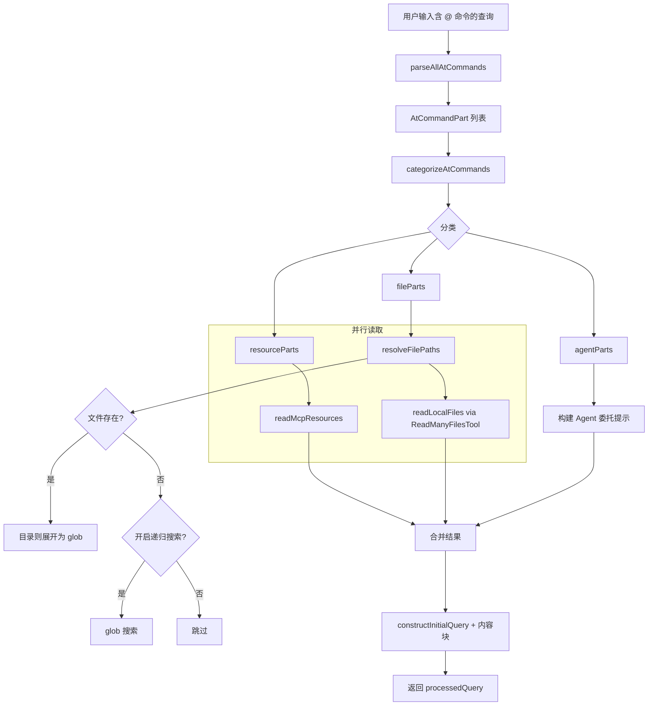

# atCommandProcessor.ts

> 处理用户输入中的 `@<路径>` 命令，解析文件引用、MCP 资源和 Agent 委托，将引用内容注入到发送给 LLM 的查询中。

## 概述

`atCommandProcessor.ts` 是 `@` 命令处理的核心模块（约 785 行），负责：

1. **解析**用户查询中的所有 `@<路径>` 引用（支持转义、引号路径、Unicode 文件名）。
2. **分类**引用为三类：Agent 名称、MCP 资源 URI、本地文件路径。
3. **解析文件路径**：处理目录展开（`dir/**`）、glob 递归搜索、`.gitignore` / `.geminiignore` 忽略规则。
4. **读取内容**：并行读取 MCP 资源和本地文件，使用 `ReadManyFilesTool` 批量读取。
5. **构建查询**：将原始查询中的 `@` 引用替换为解析后的路径，并追加文件/资源内容作为上下文。

## 架构图

## 主要导出

| 导出项 | 类型 | 说明 |
|--------|------|------|
| `handleAtCommand` | `(params: HandleAtCommandParams) => Promise<HandleAtCommandResult>` | 主入口函数，处理含 `@` 命令的查询 |
| `checkPermissions` | `(query: string, config: Config) => Promise<string[]>` | 检查查询中文件路径是否需要读取权限，返回需授权的路径列表 |
| `escapeAtSymbols` | `(text: string) => string` | 转义未转义的 `@` 符号，防止被误解析为 `@path` 命令 |
| `unescapeLiteralAt` | `(text: string) => string` | 将 `\@` 还原为 `@`，同时保留 `\\@` 序列 |
| `AT_COMMAND_PATH_REGEX_SOURCE` | `string` | `@` 命令路径匹配的正则表达式源码，供外部复用 |

## 核心逻辑

### `handleAtCommand(params)`

主函数流程：

1. 调用 `parseAllAtCommands` 使用正则表达式解析所有 `@<path>` 引用和普通文本段。
2. 调用 `categorizeAtCommands` 将 `@` 引用分为 Agent、MCP 资源、文件路径三类。
3. 调用 `resolveFilePaths` 解析文件路径（支持目录展开、glob 搜索、忽略规则过滤）。
4. 调用 `reportIgnoredFiles` 汇报被忽略的文件。
5. 并行调用 `readMcpResources` 和 `readLocalFiles` 读取内容。
6. 使用 `constructInitialQuery` 重建查询文本，替换 `@` 引用为解析后的路径规范。
7. 若存在 Agent 引用，追加 `<system_note>` 提示 LLM 委托给指定 Agent。
8. 将文件/资源内容包裹在 `REFERENCE_CONTENT_START/END` 标记中追加到查询。

### `parseAllAtCommands(query, escapePastedAtSymbols?)`

使用 `AT_COMMAND_PATH_REGEX_SOURCE` 正则表达式全局匹配 `@<path>` 模式，支持：
- 双引号路径（`@"path with spaces"`）
- 反斜杠转义（`@path\ with\ spaces`）
- Unicode 字符
- `\@` 转义（不视为命令）

### `resolveFilePaths(fileParts, config, onDebugMessage, signal)`

逐个解析文件路径：
- 检查 `.gitignore` 和 `.geminiignore` 忽略规则
- 对每个工作区目录尝试 `fs.stat` 解析绝对路径
- 目录自动展开为 `path/**` glob 模式
- 文件不存在时尝试 `glob` 工具递归搜索（需开启 `enableRecursiveFileSearch`）

### `readMcpResources(resourceParts, config, signal)`

并行读取所有 MCP 资源，通过 `mcpClientManager.getClient()` 获取对应服务器的客户端并调用 `readResource`。

### `readLocalFiles(resolvedFiles, config, signal, userMessageTimestamp)`

使用 `ReadManyFilesTool` 批量读取本地文件，支持 glob 模式和文件过滤选项。

## 内部依赖

| 模块 | 导入项 | 用途 |
|------|--------|------|
| `../types.js` | `HistoryItemToolGroup`, `IndividualToolCallDisplay` | 历史记录和工具调用显示类型 |
| `./useHistoryManager.js` | `UseHistoryManagerReturn` | 历史管理器的 `addItem` 方法类型 |

## 外部依赖

| 模块 | 导入项 | 用途 |
|------|--------|------|
| `node:fs/promises` | `fs` | 文件系统操作（`stat`） |
| `node:path` | `path` | 路径解析和拼接 |
| `node:buffer` | `Buffer` | 处理 base64 编码的二进制资源内容 |
| `@google/genai` | `PartListUnion`, `PartUnion` | Gemini API 消息部分类型 |
| `@google/gemini-cli-core` | `debugLogger`, `getErrorMessage`, `isNodeError`, `unescapePath`, `resolveToRealPath`, `fileExists`, `ReadManyFilesTool`, `REFERENCE_CONTENT_START/END`, `CoreToolCallStatus`, `Config`, `AnyToolInvocation` | 核心工具和工具类型 |
