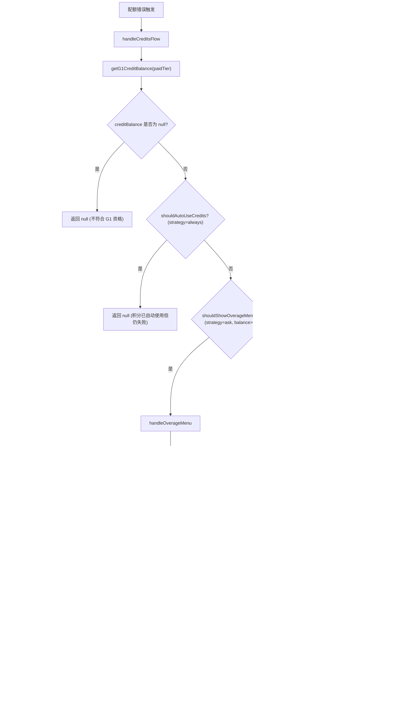

# creditsFlowHandler.ts

> 处理 G1 AI Credits（积分）流程，当用户遇到配额错误时，根据策略展示超额使用菜单或空钱包菜单，引导用户选择使用积分、降级模型或购买积分。

## 概述

`creditsFlowHandler.ts`（约 314 行）实现了 Gemini CLI 的计费积分处理流程。当 API 请求因配额超限失败时，该模块根据用户的付费层级、积分余额和超额策略，决定是否展示交互菜单以及如何处理用户的选择。

核心决策逻辑：
- **积分已自动启用**（策略为 `always`）：不处理，回退到默认的 `ProQuotaDialog`。
- **有积分余额且策略为 `ask`**：展示超额使用菜单（Overage Menu）。
- **积分余额为 0 且策略非 `never`**：展示空钱包菜单（Empty Wallet Menu）。
- **不符合上述条件**：返回 `null`，回退到默认处理。

## 架构图

## 主要导出

| 导出项 | 类型 | 说明 |
|--------|------|------|
| `handleCreditsFlow` | `(args: CreditsFlowArgs) => Promise<FallbackIntent \| null>` | 积分流程主入口函数 |

### 返回值类型 `FallbackIntent`

| 值 | 含义 |
|----|------|
| `'retry_with_credits'` | 启用积分后重试当前请求 |
| `'retry_always'` | 使用降级模型（fallback model）重试 |
| `'stop'` | 停止当前请求，不重试 |
| `null` | 不处理，回退到默认的 ProQuotaDialog |

## 核心逻辑

### `handleCreditsFlow(args)`

主入口函数，按优先级判断：

1. `getG1CreditBalance` 返回 `null` -> 用户不具备 G1 积分资格 -> `return null`。
2. `shouldAutoUseCredits` 为 `true`（`always` 策略）-> 积分已启用但请求仍失败 -> `return null`。
3. `shouldShowOverageMenu` 为 `true`（`ask` 策略 + 余额 > 0）-> 调用 `handleOverageMenu`。
4. `shouldShowEmptyWalletMenu` 为 `true`（余额 === 0 + 策略非 `never`）-> 调用 `handleEmptyWalletMenu`。
5. 均不满足 -> `return null`。

### `handleOverageMenu(args, creditBalance)` - 超额使用菜单

1. 记录 `OverageMenuShownEvent` 遥测事件。
2. 通过 `setOverageMenuRequest` + `Promise` 异步等待用户选择。
3. 记录 `OverageOptionSelectedEvent`。
4. 处理用户选择：
   - **`use_credits`**：重置配额错误状态，设置策略为 `always`，返回 `'retry_with_credits'`。
   - **`use_fallback`**：返回 `'retry_always'`（使用降级模型）。
   - **`manage`**：打开 G1 活动管理页面，返回 `'stop'`。
   - **`stop`**：返回 `'stop'`。

### `handleEmptyWalletMenu(args)` - 空钱包菜单

1. 记录 `EmptyWalletMenuShownEvent` 遥测事件。
2. 通过 `setEmptyWalletRequest` + `Promise` 异步等待用户选择。
3. 提供 `onGetCredits` 回调，用户点击后打开 G1 积分购买页面。
4. 处理用户选择：
   - **`get_credits`**：添加提示消息（积分更新可能需要几分钟），返回 `'stop'`。
   - **`use_fallback`**：返回 `'retry_always'`。
   - **`stop`**：返回 `'stop'`。

### 遥测辅助函数

| 函数 | 用途 |
|------|------|
| `logOverageOptionSelected` | 记录超额菜单选项选择事件（`OverageOptionSelectedEvent` + `recordOverageOptionSelected`） |
| `logCreditPurchaseClick` | 记录积分购买点击事件（`CreditPurchaseClickEvent` + `recordCreditPurchaseClick`） |

### `openG1Url(path, campaign)` - 打开 G1 页面

1. 获取缓存的 Google 账号邮箱。
2. 使用 `buildG1Url` 构建带 UTM 参数的 URL。
3. 若支持启动浏览器（`shouldLaunchBrowser`），调用 `openBrowserSecurely` 打开。
4. 若不支持（如 SSH 环境），返回 URL 字符串供用户手动复制。

## 内部依赖

| 模块 | 导入项 | 用途 |
|------|--------|------|
| `../types.js` | `MessageType` | 消息类型枚举 |
| `./useHistoryManager.js` | `UseHistoryManagerReturn` | 历史管理器类型 |
| `../contexts/UIStateContext.js` | `OverageMenuIntent`, `EmptyWalletIntent`, `EmptyWalletDialogRequest` | 菜单意图和请求类型 |

## 外部依赖

| 模块 | 导入项 | 用途 |
|------|--------|------|
| `@google/gemini-cli-core` | `Config`, `FallbackIntent`, `GeminiUserTier`, `OverageOption`, `getG1CreditBalance`, `shouldAutoUseCredits`, `shouldShowOverageMenu`, `shouldShowEmptyWalletMenu`, `openBrowserSecurely`, `shouldLaunchBrowser`, `logBillingEvent`, `OverageMenuShownEvent`, `OverageOptionSelectedEvent`, `EmptyWalletMenuShownEvent`, `CreditPurchaseClickEvent`, `buildG1Url`, `G1_UTM_CAMPAIGNS`, `UserAccountManager`, `recordOverageOptionSelected`, `recordCreditPurchaseClick` | 计费核心逻辑、遥测事件、URL 构建和浏览器操作 |
