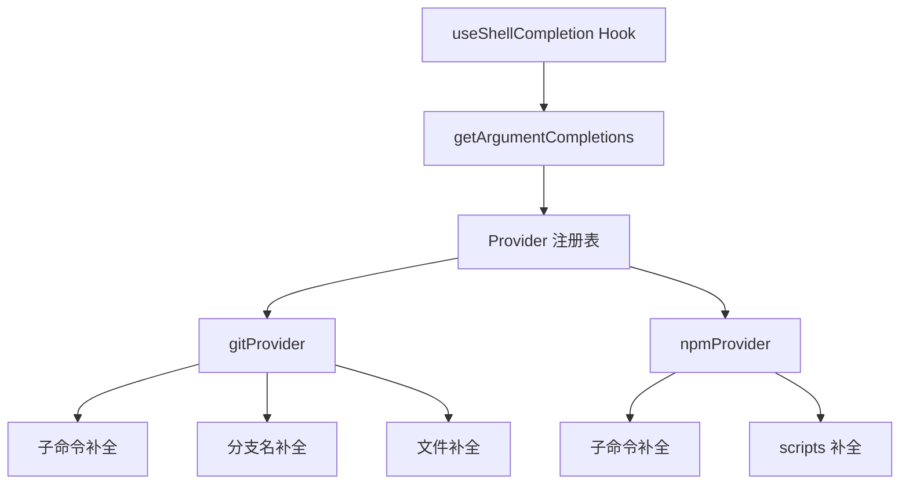

# shell-completions 架构

> Shell 命令参数补全提供器，为 git 和 npm 等常用命令提供智能补全

## 概述

`shell-completions` 目录实现了 Shell 模式下特定命令的参数补全。当用户在 Shell 模式中输入 `git` 或 `npm` 命令时，系统会根据当前输入的子命令和参数，提供上下文感知的补全建议（如 git 分支名、npm 脚本名等）。这通过 Provider 模式实现，每个命令有独立的补全提供器。

## 架构图



## 目录结构

```
shell-completions/
├── index.ts          # 入口，注册所有 Provider 并路由补全请求
├── types.ts          # ShellCompletionProvider 和 CompletionResult 类型定义
├── gitProvider.ts    # git 命令补全提供器
└── npmProvider.ts    # npm 命令补全提供器
```

## 关键文件

| 文件 | 功能 |
|------|------|
| `index.ts` | 入口函数 `getArgumentCompletions`，根据命令 token 查找对应 Provider 并返回补全结果 |
| `types.ts` | 定义 `ShellCompletionProvider` 接口（command、getCompletions）和 `CompletionResult`（suggestions、exclusive） |
| `gitProvider.ts` | git 命令补全：子命令（add/branch/checkout 等）、分支名（调用 `git branch`）、暂存文件等 |
| `npmProvider.ts` | npm 命令补全：子命令（build/install/run 等）、package.json 中的 scripts 名称 |

## 内部依赖

- `../useShellCompletion` - `escapeShellPath` 工具函数
- `../../components/SuggestionsDisplay` - `Suggestion` 类型

## 外部依赖

| 包名 | 用途 |
|------|------|
| `node:child_process` | execFile（执行 git 命令获取分支列表） |
| `node:util` | promisify |
| `node:fs/promises` | 读取 package.json 获取 scripts |
| `node:path` | 路径拼接 |
