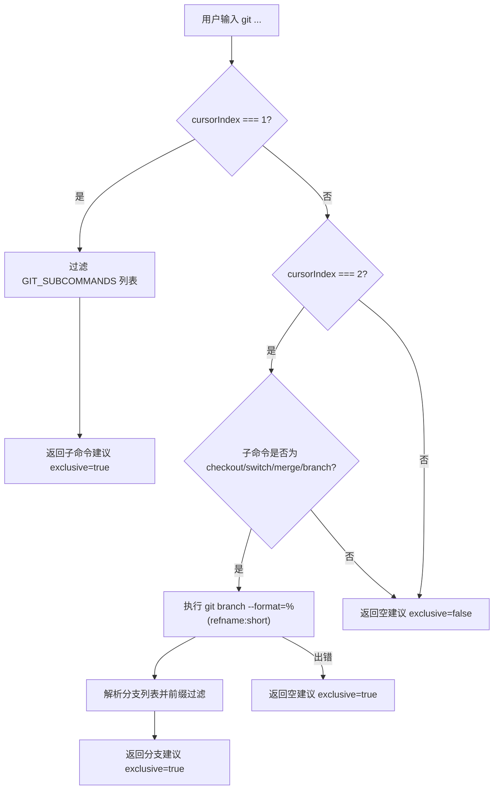

# gitProvider.ts

> 为 Git 命令提供 Shell 自动补全建议，包括子命令和分支名称补全。

## 概述

`gitProvider.ts` 实现了一个符合 `ShellCompletionProvider` 接口的 Git 命令补全提供器。当用户在 Shell 模式下输入 `git` 命令时，该模块能够：

1. **补全 Git 子命令**：当光标位于第一个参数位置时，提供常用 Git 子命令（如 `add`、`branch`、`checkout` 等）的前缀匹配补全。
2. **补全分支名称**：当子命令为 `checkout`、`switch`、`merge` 或 `branch` 时，通过实际执行 `git branch --format=%(refname:short)` 命令获取本地分支列表，并提供前缀匹配补全。

## 架构图

## 主要导出

| 导出项 | 类型 | 说明 |
|--------|------|------|
| `gitProvider` | `ShellCompletionProvider` | Git 命令补全提供器对象，包含 `command` 字段（值为 `'git'`）和 `getCompletions` 异步方法 |

## 核心逻辑

### `getCompletions(tokens, cursorIndex, cwd, signal?)`

异步方法，根据当前的命令 token 列表和光标所在的 token 索引返回补全结果。

- **`cursorIndex === 1`**（补全子命令）：从预定义的 `GIT_SUBCOMMANDS` 数组（包含 11 个常用命令）中进行前缀匹配过滤，返回 `exclusive: true` 以阻止文件路径回退补全。
- **`cursorIndex === 2`**（补全分支名称）：仅当子命令为 `checkout`、`switch`、`merge` 或 `branch` 时生效。通过 `execFileAsync` 调用 `git branch` 获取本地分支，支持 `AbortSignal` 中断。分支名通过 `escapeShellPath` 进行转义处理。如果 `git` 命令执行失败（如不在 Git 仓库中），静默返回空列表。
- **其他位置**：返回 `exclusive: false`，允许回退到默认的文件路径补全。

### 常量 `GIT_SUBCOMMANDS`

预定义的 Git 子命令列表：`add`、`branch`、`checkout`、`commit`、`diff`、`merge`、`pull`、`push`、`rebase`、`status`、`switch`。

## 内部依赖

| 模块 | 导入项 | 用途 |
|------|--------|------|
| `./types.js` | `ShellCompletionProvider`, `CompletionResult` | 补全提供器接口和返回值类型定义 |
| `../useShellCompletion.js` | `escapeShellPath` | 对分支名中的特殊字符进行 Shell 转义 |

## 外部依赖

| 模块 | 导入项 | 用途 |
|------|--------|------|
| `node:child_process` | `execFile` | 异步执行 `git branch` 命令获取分支列表 |
| `node:util` | `promisify` | 将 `execFile` 转换为 Promise 风格的 `execFileAsync` |
