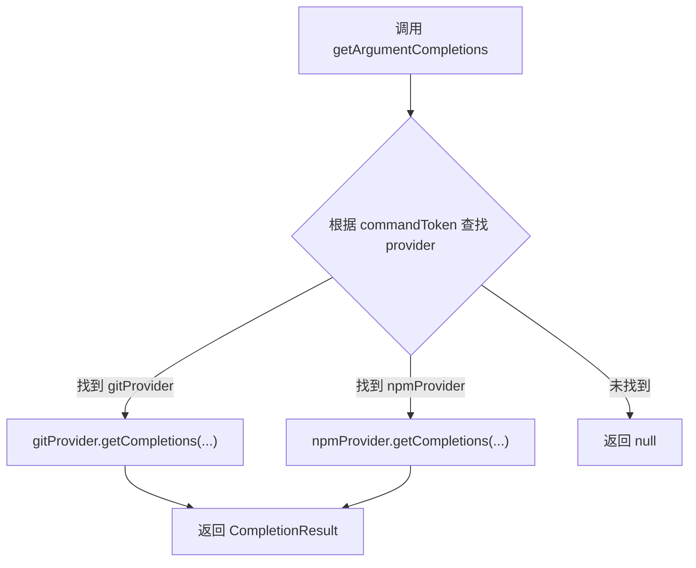

# index.ts (shell-completions)

> Shell 补全系统的统一入口，根据命令名称路由到对应的补全提供器。

## 概述

`index.ts` 是 `shell-completions` 模块的入口文件，负责管理所有注册的 Shell 补全提供器（目前包括 `gitProvider` 和 `npmProvider`），并对外暴露统一的 `getArgumentCompletions` 函数。调用方只需传入当前命令的 token，该函数会自动查找匹配的提供器并返回补全结果。

## 架构图

## 主要导出

| 导出项 | 类型 | 说明 |
|--------|------|------|
| `getArgumentCompletions` | `(commandToken, tokens, cursorIndex, cwd, signal?) => Promise<CompletionResult \| null>` | 根据命令名查找对应提供器并返回补全结果；未匹配时返回 `null` |

## 核心逻辑

### `getArgumentCompletions(commandToken, tokens, cursorIndex, cwd, signal?)`

1. 在内部 `providers` 数组中查找 `command` 字段与 `commandToken` 匹配的提供器。
2. 若找到匹配的提供器，调用其 `getCompletions` 方法并返回结果。
3. 若未找到，返回 `null`，表示该命令没有注册专用的补全逻辑，应回退到默认补全行为。

### 内部常量 `providers`

类型为 `ShellCompletionProvider[]` 的数组，当前注册了两个提供器：
- `gitProvider`：处理 `git` 命令的补全
- `npmProvider`：处理 `npm` 命令的补全

新增补全提供器只需在此数组中添加即可。

## 内部依赖

| 模块 | 导入项 | 用途 |
|------|--------|------|
| `./types.js` | `ShellCompletionProvider`, `CompletionResult` | 类型定义 |
| `./gitProvider.js` | `gitProvider` | Git 命令补全提供器实例 |
| `./npmProvider.js` | `npmProvider` | npm 命令补全提供器实例 |

## 外部依赖

无。
