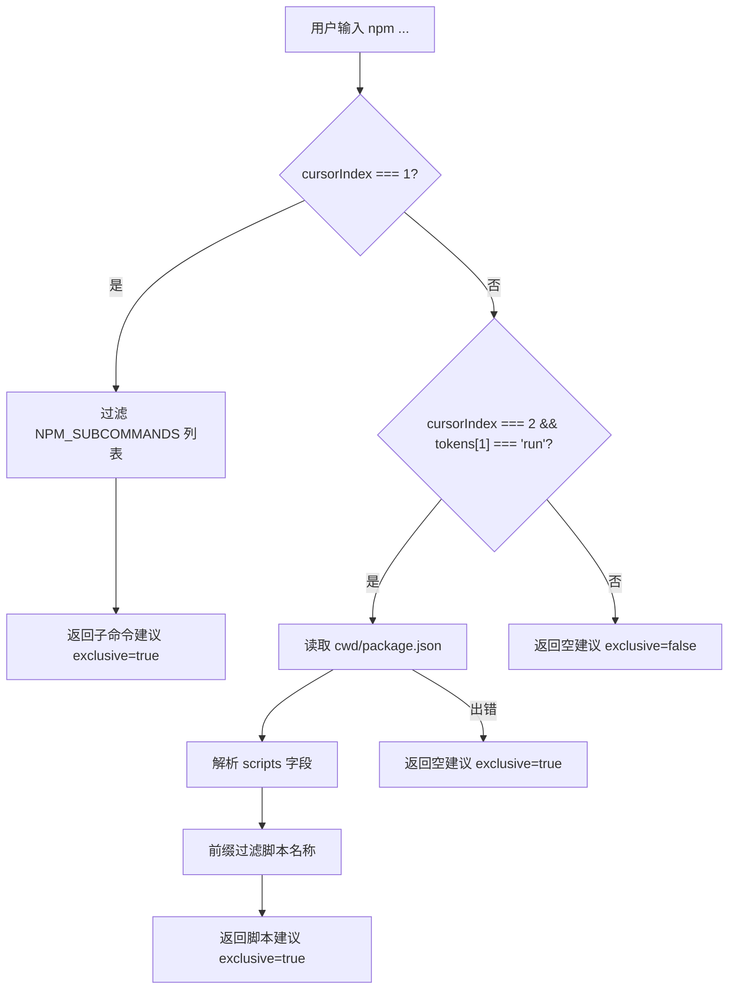

# npmProvider.ts

> 为 npm 命令提供 Shell 自动补全建议，包括子命令和 `npm run` 脚本名称补全。

## 概述

`npmProvider.ts` 实现了一个符合 `ShellCompletionProvider` 接口的 npm 命令补全提供器。其功能与 `gitProvider` 类似，分为两层补全：

1. **子命令补全**：当光标位于第一个参数时，提供常用 npm 子命令（`build`、`ci`、`dev`、`install` 等）的前缀匹配补全。
2. **脚本名称补全**：当子命令为 `run` 且光标位于第二个参数时，读取当前工作目录下的 `package.json` 文件，解析 `scripts` 字段，并提供脚本名称的前缀匹配补全。

## 架构图

## 主要导出

| 导出项 | 类型 | 说明 |
|--------|------|------|
| `npmProvider` | `ShellCompletionProvider` | npm 命令补全提供器对象，包含 `command` 字段（值为 `'npm'`）和 `getCompletions` 异步方法 |

## 核心逻辑

### `getCompletions(tokens, cursorIndex, cwd, signal?)`

- **`cursorIndex === 1`**（补全子命令）：从预定义的 `NPM_SUBCOMMANDS` 数组中进行前缀匹配，返回 `exclusive: true`。
- **`cursorIndex === 2` 且 `tokens[1] === 'run'`**（补全脚本名称）：
  1. 检查 `signal?.aborted`，若已中断则提前返回。
  2. 通过 `fs.readFile` 读取 `cwd/package.json`。
  3. 安全解析 JSON 并提取 `scripts` 对象的键名。
  4. 对脚本名称进行前缀过滤，通过 `escapeShellPath` 转义后返回。
  5. 若文件不存在或 JSON 无效，静默返回空列表。
- **其他位置**：返回 `exclusive: false`，回退到默认文件路径补全。

### 常量 `NPM_SUBCOMMANDS`

预定义的 npm 子命令列表：`build`、`ci`、`dev`、`install`、`publish`、`run`、`start`、`test`。

## 内部依赖

| 模块 | 导入项 | 用途 |
|------|--------|------|
| `./types.js` | `ShellCompletionProvider`, `CompletionResult` | 类型定义 |
| `../useShellCompletion.js` | `escapeShellPath` | 对脚本名中的特殊字符进行 Shell 转义 |

## 外部依赖

| 模块 | 导入项 | 用途 |
|------|--------|------|
| `node:fs/promises` | `fs` | 异步读取 `package.json` 文件内容 |
| `node:path` | `path` | 拼接 `cwd` 和 `package.json` 的完整路径 |
