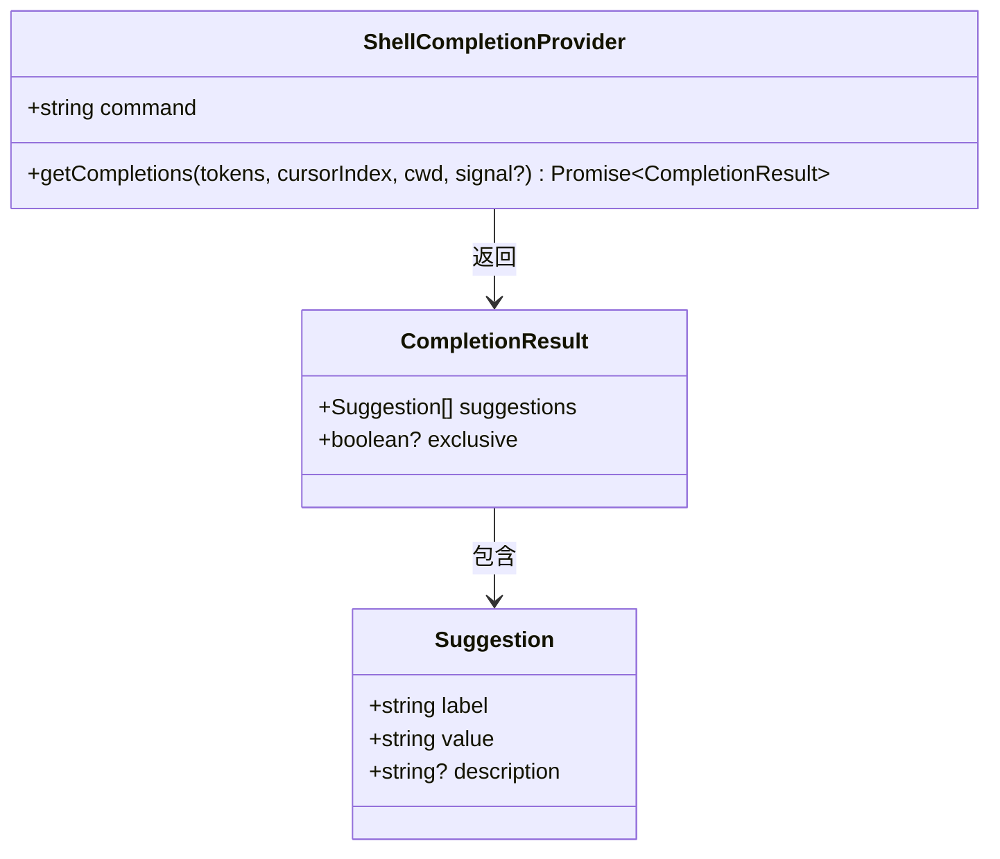

# types.ts (shell-completions)

> 定义 Shell 补全系统的核心类型接口，包括补全结果和补全提供器的契约。

## 概述

`types.ts` 是 `shell-completions` 模块的类型定义文件，提供了两个关键接口：

- **`CompletionResult`**：描述补全操作的返回值，包含建议列表和排他性标志。
- **`ShellCompletionProvider`**：定义补全提供器必须实现的契约，任何新增的命令补全（如 `docker`、`kubectl`）都需要实现该接口。

## 架构图

## 主要导出

| 导出项 | 类型 | 说明 |
|--------|------|------|
| `CompletionResult` | `interface` | 补全结果接口，包含 `suggestions` 建议数组和可选的 `exclusive` 排他性标志 |
| `ShellCompletionProvider` | `interface` | 补全提供器接口，要求实现 `command` 字段和 `getCompletions` 异步方法 |

## 核心逻辑

### `CompletionResult` 接口

| 字段 | 类型 | 说明 |
|------|------|------|
| `suggestions` | `Suggestion[]` | 补全建议列表，`Suggestion` 类型来自 `SuggestionsDisplay` 组件 |
| `exclusive` | `boolean?` | 若为 `true`，阻止 Shell 在该列表之后追加通用的文件/路径补全。适用于只接受特定值的场景（如分支名称）。默认为 `false` |

### `ShellCompletionProvider` 接口

| 字段 | 类型 | 说明 |
|------|------|------|
| `command` | `string` | 触发该提供器的命令名称（如 `'git'`、`'npm'`） |
| `getCompletions` | `(tokens: string[], cursorIndex: number, cwd: string, signal?: AbortSignal) => Promise<CompletionResult>` | 核心补全方法 |

**`getCompletions` 参数说明：**

- `tokens`：从用户输入中解析出的参数列表
- `cursorIndex`：光标当前所在的 token 索引
- `cwd`：当前工作目录
- `signal`：可选的 `AbortSignal`，用于中断长时间运行的补全操作

## 内部依赖

| 模块 | 导入项 | 用途 |
|------|--------|------|
| `../../components/SuggestionsDisplay.js` | `Suggestion` | 建议项的类型定义（包含 `label`、`value`、`description` 等字段） |

## 外部依赖

无。
