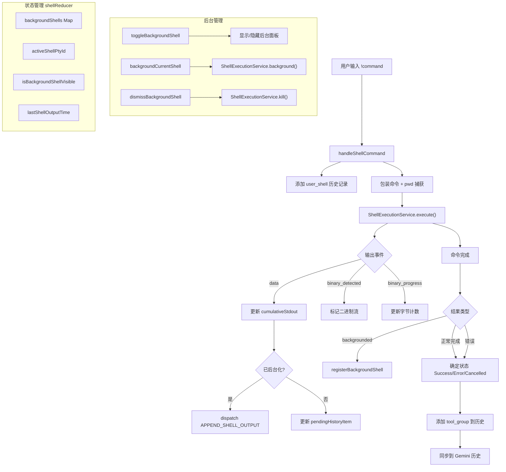

# shellCommandProcessor.ts

> React Hook，负责编排 Shell 命令的执行生命周期，包括前台执行、后台管理、PTY 交互和历史记录更新。

## 概述

`shellCommandProcessor.ts`（约 557 行）实现了 `useShellCommandProcessor` Hook，是用户在 CLI 中直接执行 Shell 命令（以 `!` 前缀触发）的核心处理器。该模块管理了：

1. **命令执行**：通过 `ShellExecutionService` 在指定工作目录中执行 Shell 命令，支持交互式 PTY 模式。
2. **后台 Shell 管理**：支持将正在执行的命令转入后台（Ctrl+B），维护后台 Shell 的状态、输出订阅和生命周期。
3. **输出流式显示**：实时将命令输出更新到 pending history item，支持 ANSI 输出和二进制流检测。
4. **工作目录追踪**：在非 Windows 平台上捕获命令执行后的最终工作目录，若发生变化则发出警告。
5. **Gemini 历史同步**：将 Shell 命令及其输出添加到 Gemini 对话历史，使 AI 模型感知用户的 Shell 操作。

## 架构图

## 主要导出

| 导出项 | 类型 | 说明 |
|--------|------|------|
| `useShellCommandProcessor` | React Hook | Shell 命令处理器 Hook，返回命令处理函数和后台 Shell 管理接口 |
| `BackgroundShell` | `type` (re-export) | 后台 Shell 信息类型，来自 `shellReducer` |
| `OUTPUT_UPDATE_INTERVAL_MS` | `const number` | 输出更新间隔（1000ms） |

### Hook 返回值

| 字段 | 类型 | 说明 |
|------|------|------|
| `handleShellCommand` | `(rawQuery, abortSignal) => boolean` | 执行 Shell 命令，返回是否已处理 |
| `activeShellPtyId` | `number \| null` | 当前前台 Shell 的 PTY ID |
| `lastShellOutputTime` | `number` | 最后一次 Shell 输出的时间戳 |
| `backgroundShellCount` | `number` | 运行中的后台 Shell 数量 |
| `isBackgroundShellVisible` | `boolean` | 后台 Shell 面板是否可见 |
| `toggleBackgroundShell` | `() => void` | 切换后台 Shell 面板显示 |
| `backgroundCurrentShell` | `() => void` | 将当前前台 Shell 转为后台 |
| `registerBackgroundShell` | `(pid, command, initialOutput) => void` | 注册新的后台 Shell |
| `dismissBackgroundShell` | `(pid) => Promise<void>` | 关闭并移除指定后台 Shell |
| `backgroundShells` | `Map<number, BackgroundShell>` | 所有后台 Shell 的状态映射 |

## 核心逻辑

### `handleShellCommand(rawQuery, abortSignal)`

1. 将用户命令作为 `user_shell` 类型添加到历史。
2. 在非 Windows 平台上，将命令包装为 `{ command; }; __code=$?; pwd > tmpfile; exit $__code` 以捕获最终工作目录。
3. 创建初始 `IndividualToolCallDisplay`（状态为 `Executing`），设置为 pending history item。
4. 通过 `ShellExecutionService.execute` 执行命令，传入流式输出回调。
5. 输出回调中处理 `data`（累积输出）、`binary_detected`、`binary_progress` 事件。
6. 若命令已被后台化，通过 `dispatch` 将输出转发给后台 Shell 订阅。
7. 命令完成后根据 `result.error`、`result.aborted`、`result.backgrounded`、`result.signal`、`result.exitCode` 确定最终状态。
8. 若检测到工作目录变化，在输出前附加警告信息。
9. 调用 `addShellCommandToGeminiHistory` 将命令和输出同步到 Gemini 对话历史（截断至 10000 字符）。

### 后台 Shell 可见性管理

通过 `useEffect` 监听 `activePtyId` 和 `isWaitingForConfirmation`：
- 前台有活动时自动隐藏后台面板
- 前台活动结束后延迟 300ms 恢复之前的可见状态
- 手动切换优先级高于自动逻辑

### 后台 Shell 订阅

`registerBackgroundShell` 会同时订阅进程退出事件和数据事件：
- `onExit`：更新状态为 `exited`
- `subscribe`：处理 `data`、`binary_detected`、`binary_progress` 事件
- `dismissBackgroundShell`：先 kill 运行中的进程，再清理状态和取消订阅

## 内部依赖

| 模块 | 导入项 | 用途 |
|------|--------|------|
| `../types.js` | `HistoryItemWithoutId`, `IndividualToolCallDisplay` | 历史记录类型 |
| `./useHistoryManager.js` | `UseHistoryManagerReturn` | 历史管理器类型 |
| `../constants.js` | `SHELL_COMMAND_NAME` | Shell 命令名称常量 |
| `../utils/formatters.js` | `formatBytes` | 格式化二进制字节数 |
| `../../ui/themes/theme-manager.js` | `themeManager` | 获取当前主题颜色配置用于 PTY |
| `./shellReducer.js` | `shellReducer`, `initialState`, `BackgroundShell` | 后台 Shell 状态管理 reducer |

## 外部依赖

| 模块 | 导入项 | 用途 |
|------|--------|------|
| `react` | `useCallback`, `useReducer`, `useRef`, `useEffect` | React Hook 基础设施 |
| `@google/genai` | `PartListUnion` | 消息类型 |
| `@google/gemini-cli-core` | `isBinary`, `ShellExecutionService`, `CoreToolCallStatus`, `Config`, `GeminiClient`, `AnsiOutput` | 核心 Shell 执行服务和类型 |
| `node:crypto` | `crypto` | 生成临时文件名的随机后缀 |
| `node:path` | `path` | 路径拼接 |
| `node:os` | `os` | 判断平台和获取临时目录 |
| `node:fs` | `fs` | 同步读写临时 pwd 文件 |
