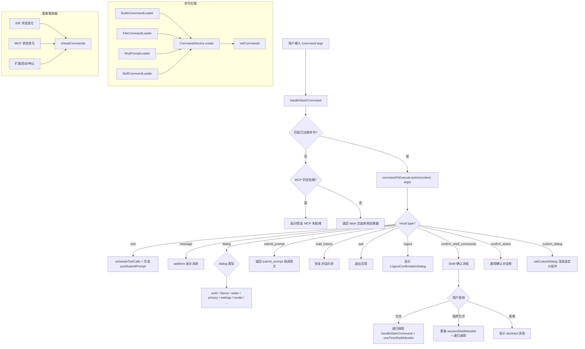

# slashCommandProcessor.ts

> React Hook，负责定义、加载和执行斜杠命令（如 `/help`、`/clear`、`/theme`），管理命令生命周期和结果分发。

## 概述

`slashCommandProcessor.ts`（约 743 行）实现了 `useSlashCommandProcessor` Hook，是 CLI 中所有斜杠命令的统一处理入口。其职责包括：

1. **命令加载**：通过四种 `CommandLoader` 并行加载命令源（内置命令、文件命令、MCP Prompt 命令、Skill 命令），并监听 IDE/MCP/扩展事件动态重载。
2. **命令解析**：使用 `parseSlashCommand` 将用户输入映射到具体命令和参数。
3. **命令执行**：调用命令的 `action` 方法，并根据返回的 `result.type` 分发到不同的处理分支（工具调度、对话框、提示提交、历史加载、退出等）。
4. **Shell 命令确认流**：对需要 Shell 权限的斜杠命令展示确认对话框，支持"始终允许"策略。
5. **遥测日志**：记录斜杠命令的执行状态（成功/错误）。

## 架构图

## 主要导出

| 导出项 | 类型 | 说明 |
|--------|------|------|
| `useSlashCommandProcessor` | React Hook | 斜杠命令处理器 Hook |

### Hook 返回值

| 字段 | 类型 | 说明 |
|------|------|------|
| `handleSlashCommand` | `(rawQuery, oneTimeShellAllowlist?, overwriteConfirmed?, addToHistory?) => Promise<SlashCommandProcessorResult \| false>` | 执行斜杠命令，返回处理结果或 `false` 表示非斜杠命令 |
| `slashCommands` | `readonly SlashCommand[] \| undefined` | 当前已加载的所有斜杠命令列表 |
| `pendingHistoryItems` | `HistoryItemWithoutId[]` | 正在处理中的历史项（用于 Shell 确认 UI） |
| `commandContext` | `CommandContext` | 命令执行上下文，包含服务、UI 操作和会话信息 |
| `confirmationRequest` | 确认请求对象或 `null` | 当前活跃的确认对话框请求 |

## 核心逻辑

### 命令加载和重载

- 使用 `useEffect` 创建 `CommandService`，传入四种 `CommandLoader`：
  - `BuiltinCommandLoader`：内置命令（`/help`、`/clear`、`/quit` 等）
  - `FileCommandLoader`：从文件系统加载的命令
  - `McpPromptLoader`：从 MCP 服务器的 prompt 注册表加载
  - `SkillCommandLoader`：从 Skill 扩展加载
- 监听 IDE 状态变化、MCP 状态变化、扩展启动/停止事件触发 `reloadCommands`

### `handleSlashCommand(rawQuery, ...)`

1. 调用 `parseSlashCommand` 解析命令名和参数。
2. 若未匹配命令且 MCP 正在加载，提示用户稍后重试。
3. 构建 `CommandContext` 包含 `services`（config/settings/git/logger）、`ui`（各种 UI 操作函数）、`session`（统计和 Shell 白名单）。
4. 调用 `commandToExecute.action(context, args)` 获取结果。
5. 根据 `result.type` 分发处理（共 12 种结果类型）。

### Shell 确认流程 (`confirm_shell_commands`)

1. 创建 `ToolCallConfirmationDetails`（类型为 `exec`），展示待确认的 Shell 命令。
2. 用 `Promise` 包装用户的确认选择。
3. 若用户选择 `ProceedAlways`，将命令添加到 `sessionShellAllowlist`。
4. 递归调用 `handleSlashCommand`，传入 `oneTimeShellAllowlist` 和 `addToHistory: false`。

### 遥测

在 `try/finally` 块中，使用 `logSlashCommand` 记录命令名、子命令、状态和扩展 ID。

## 内部依赖

| 模块 | 导入项 | 用途 |
|------|--------|------|
| `../types.js` | 多种历史记录和 UI 类型 | 类型定义 |
| `./useHistoryManager.js` | `UseHistoryManagerReturn` | 历史管理器类型 |
| `../commands/types.js` | `CommandContext`, `SlashCommand` | 命令类型定义 |
| `../../services/CommandService.js` | `CommandService` | 命令服务（管理命令注册和查询） |
| `../../services/BuiltinCommandLoader.js` | `BuiltinCommandLoader` | 内置命令加载器 |
| `../../services/FileCommandLoader.js` | `FileCommandLoader` | 文件命令加载器 |
| `../../services/McpPromptLoader.js` | `McpPromptLoader` | MCP Prompt 命令加载器 |
| `../../services/SkillCommandLoader.js` | `SkillCommandLoader` | Skill 命令加载器 |
| `../../utils/commands.js` | `parseSlashCommand` | 斜杠命令解析 |
| `../state/extensions.js` | `ExtensionUpdateAction`, `ExtensionUpdateStatus` | 扩展状态类型 |
| `../components/LogoutConfirmationDialog.js` | `LogoutConfirmationDialog`, `LogoutChoice` | 注销确认对话框 |
| `../../utils/cleanup.js` | `runExitCleanup` | 退出时的清理操作 |
| `../contexts/SessionContext.js` | `useSessionStats` | 会话统计 |
| `../../config/settings.js` | `LoadedSettings` | 设置类型 |

## 外部依赖

| 模块 | 导入项 | 用途 |
|------|--------|------|
| `react` | `useCallback`, `useMemo`, `useEffect`, `useState`, `createElement` | React Hook 基础设施 |
| `@google/genai` | `PartListUnion` | 消息类型 |
| `node:process` | `process` | 进程操作（退出） |
| `@google/gemini-cli-core` | `GitService`, `Logger`, `logSlashCommand`, `SlashCommandStatus`, `ToolConfirmationOutcome`, `Storage`, `IdeClient`, `coreEvents`, `addMCPStatusChangeListener`, `MCPDiscoveryState`, `CoreToolCallStatus` 等 | 核心服务和事件系统 |
