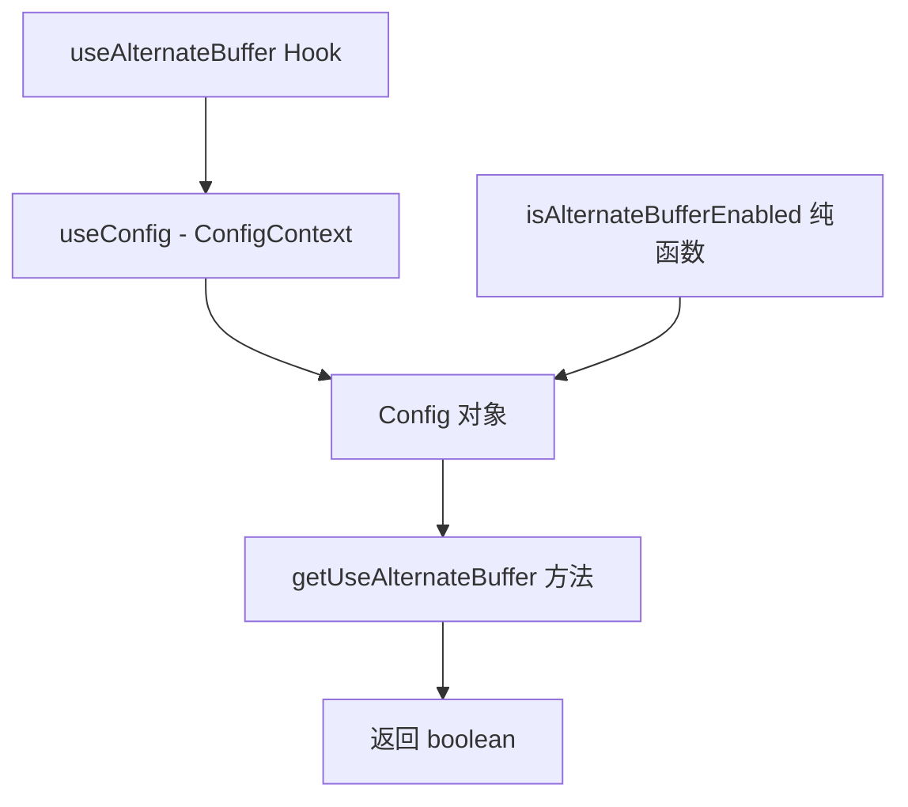

# useAlternateBuffer.ts

> 判断并返回终端是否启用备用缓冲区模式

## 概述

`useAlternateBuffer` 是一个轻量级 React Hook，用于从应用配置中读取终端备用缓冲区（Alternate Buffer）的启用状态。备用缓冲区是终端模拟器的一项功能，允许应用在独立的屏幕缓冲区中运行，退出后恢复原来的终端内容。该 Hook 确保在整个应用会话中读取一致的配置值。

同时导出了一个纯函数 `isAlternateBufferEnabled`，可以在 Hook 上下文之外使用。

## 架构图（mermaid）

## 主要导出

| 导出名 | 类型 | 说明 |
|--------|------|------|
| `isAlternateBufferEnabled` | `(config: Config) => boolean` | 纯函数，根据 Config 对象判断是否启用备用缓冲区 |
| `useAlternateBuffer` | `() => boolean` | React Hook，通过 ConfigContext 获取并返回备用缓冲区启用状态 |

## 核心逻辑

1. `useAlternateBuffer` Hook 内部调用 `useConfig()` 从 `ConfigContext` 获取全局配置对象。
2. 调用 `isAlternateBufferEnabled(config)` 判断 `config.getUseAlternateBuffer()` 的返回值。
3. 返回 `boolean` 值，指示备用缓冲区是否启用。

## 内部依赖

| 依赖 | 路径 | 说明 |
|------|------|------|
| `useConfig` | `../contexts/ConfigContext.js` | 获取全局 Config 上下文 |

## 外部依赖

| 依赖 | 说明 |
|------|------|
| `@google/gemini-cli-core` | 提供 `Config` 类型定义 |
