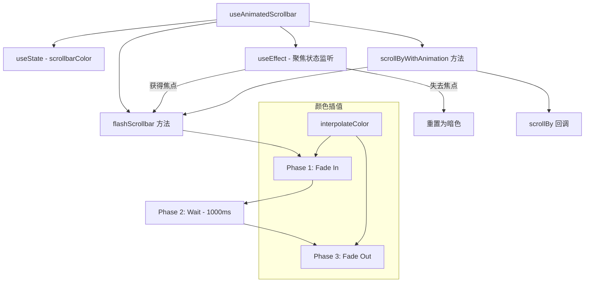

# useAnimatedScrollbar.ts

> 管理滚动条的渐入/渐出颜色动画效果

## 概述

`useAnimatedScrollbar` 是一个 React Hook，为自定义滚动条提供颜色动画功能。当用户滚动或聚焦时，滚动条会以平滑的渐入（Fade In）动画变亮，保持一段时间后再以渐出（Fade Out）动画恢复为暗色。动画以 ~30fps（33ms 间隔）运行，在测试环境中会跳过动画。

该 Hook 还跟踪动画组件数量（用于调试），并在组件卸载或状态变化时正确清理定时器。

## 架构图（mermaid）

## 主要导出

| 导出名 | 类型 | 说明 |
|--------|------|------|
| `useAnimatedScrollbar` | `(isFocused: boolean, scrollBy: (delta: number) => void) => { scrollbarColor, flashScrollbar, scrollByWithAnimation }` | 返回当前滚动条颜色、闪烁触发函数和带动画的滚动函数 |

## 核心逻辑

1. **颜色状态管理**：使用 `useState` 维护当前滚动条颜色，初始为 `theme.ui.dark`。
2. **动画三阶段**：
   - **Fade In**（200ms）：从当前颜色插值到 `theme.text.secondary`。
   - **Visible**（1000ms）：保持亮色。
   - **Fade Out**（300ms）：从亮色插值回 `theme.ui.dark`。
3. **焦点联动**：`useEffect` 监听 `isFocused` 变化，获得焦点时触发闪烁，失去焦点时立即重置。
4. **清理机制**：`cleanup` 函数清理所有 `setInterval`/`setTimeout`，并维护 `debugState.debugNumAnimatedComponents` 计数。
5. **测试模式**：`NODE_ENV === 'test'` 时所有动画时长为 0，立即完成。

## 内部依赖

| 依赖 | 路径 | 说明 |
|------|------|------|
| `theme` | `../semantic-colors.js` | 语义化主题颜色 |
| `interpolateColor` | `../themes/color-utils.js` | 颜色插值工具函数 |
| `debugState` | `../debug.js` | 调试状态，追踪动画组件数量 |

## 外部依赖

| 依赖 | 说明 |
|------|------|
| `react` | `useState`, `useEffect`, `useRef`, `useCallback` |
