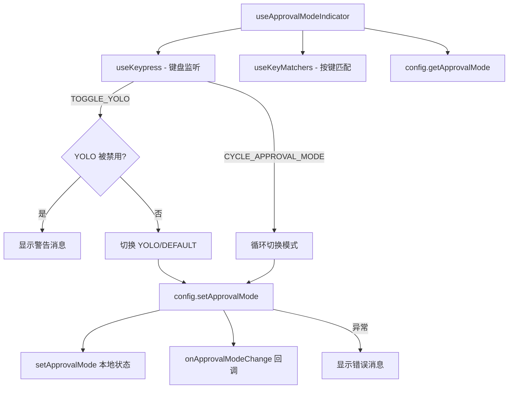

# useApprovalModeIndicator.ts

> 监听快捷键切换审批模式（DEFAULT / AUTO_EDIT / PLAN / YOLO）并同步状态

## 概述

`useApprovalModeIndicator` 是一个 React Hook，用于管理 Gemini CLI 的工具执行审批模式。它监听用户键盘快捷键，支持两种切换方式：

1. **YOLO 模式切换**（`TOGGLE_YOLO`）：在 YOLO 和 DEFAULT 之间切换，若 YOLO 模式被管理员或配置禁用则显示警告。
2. **循环切换**（`CYCLE_APPROVAL_MODE`）：在 DEFAULT -> AUTO_EDIT -> PLAN（可选） -> DEFAULT 之间循环。

状态变更会同时更新到配置对象和本地 React 状态，确保 UI 响应及时。

## 架构图（mermaid）

## 主要导出

| 导出名 | 类型 | 说明 |
|--------|------|------|
| `UseApprovalModeIndicatorArgs` | `interface` | Hook 参数接口：config、addItem、onApprovalModeChange、isActive、allowPlanMode |
| `useApprovalModeIndicator` | `(args: UseApprovalModeIndicatorArgs) => ApprovalMode` | 返回当前审批模式 |

## 核心逻辑

1. 从 `config.getApprovalMode()` 初始化状态，通过 `useEffect` 在配置变化时同步。
2. `useKeypress` 注册键盘监听器，根据 `keyMatchers` 判断按键类型。
3. YOLO 切换前检查 `config.isYoloModeDisabled()` 和管理员远程设置。
4. 循环模式切换支持从 YOLO 直接跳转到 AUTO_EDIT（跳过 DEFAULT）。
5. 调用 `config.setApprovalMode()` 持久化设置，若抛出异常则通过 `addItem` 显示错误信息。

## 内部依赖

| 依赖 | 路径 | 说明 |
|------|------|------|
| `useKeypress` | `./useKeypress.js` | 键盘事件监听 Hook |
| `useKeyMatchers` | `./useKeyMatchers.js` | 按键命令匹配 |
| `Command` | `../key/keyMatchers.js` | 按键命令枚举 |
| `MessageType` | `../types.js` | 消息类型枚举 |

## 外部依赖

| 依赖 | 说明 |
|------|------|
| `react` | `useState`, `useEffect` |
| `@google/gemini-cli-core` | `ApprovalMode`, `Config`, `getAdminErrorMessage` |
