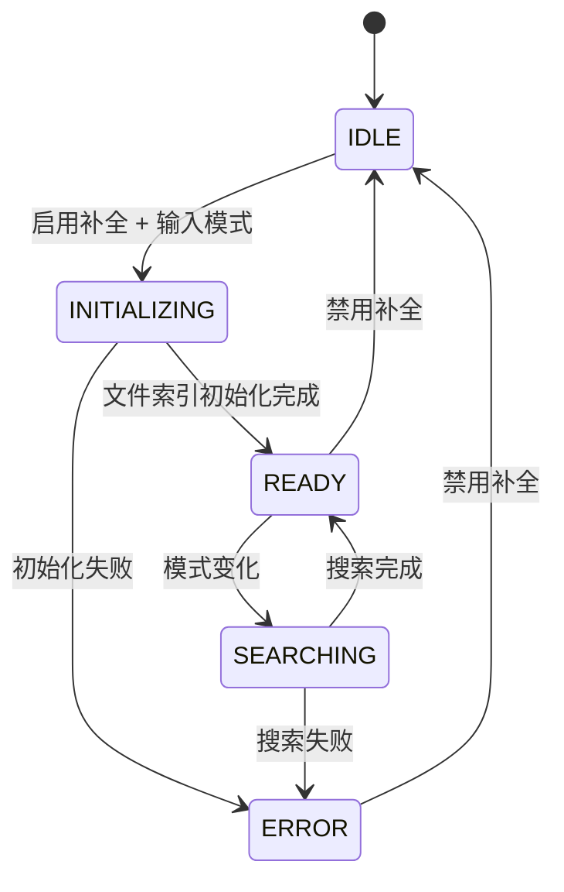
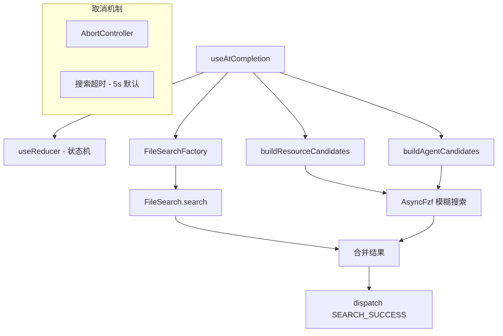

# useAtCompletion.ts

> 提供 @ 符号触发的文件、MCP 资源和 Agent 补全建议功能

## 概述

`useAtCompletion` 是一个复杂的 React Hook，实现了当用户在输入框中键入 `@` 符号时的自动补全功能。它管理三种类型的补全源：

1. **文件搜索**：基于工作区目录，使用 `FileSearchFactory` 创建的搜索器进行模糊搜索。
2. **MCP 资源**：从 `ResourceRegistry` 获取可用的 MCP 资源。
3. **Agent**：从 `AgentRegistry` 获取可用的 Agent 定义。

该 Hook 采用了 `useReducer` 状态机模式管理五种状态（IDLE -> INITIALIZING -> READY <-> SEARCHING / ERROR），支持防抖加载指示、搜索超时和请求取消。

## 架构图（mermaid）

## 主要导出

| 导出名 | 类型 | 说明 |
|--------|------|------|
| `AtCompletionStatus` | `enum` | 补全状态：IDLE / INITIALIZING / READY / SEARCHING / ERROR |
| `UseAtCompletionProps` | `interface` | Hook 参数：enabled, pattern, config, cwd, setSuggestions, setIsLoadingSuggestions |
| `useAtCompletion` | `(props: UseAtCompletionProps) => void` | 主 Hook，通过回调设置外部建议状态 |

## 核心逻辑

1. **状态机**：使用 `useReducer` 管理 `AtCompletionState`，包含 status、suggestions、isLoading、pattern。
2. **文件搜索初始化**：为每个工作区目录创建独立的 `FileSearch` 实例，缓存在 `fileSearchMap` 中。
3. **搜索流程**：并行搜索所有目录的文件、MCP 资源和 Agent，合并为 `combinedSuggestions`。
4. **防抖加载**：搜索开始 200ms 后才显示 loading 状态，避免闪烁。
5. **Epoch 机制**：`initEpoch` 用于在 cwd/config 变化时使旧的初始化结果失效。
6. **超时控制**：使用 `AbortController` + `setTimeoutPromise` 实现可配置的搜索超时。

## 内部依赖

| 依赖 | 路径 | 说明 |
|------|------|------|
| `MAX_SUGGESTIONS_TO_SHOW` | `../components/SuggestionsDisplay.js` | 最大建议显示数量 |
| `CommandKind` | `../commands/types.js` | Agent 命令类型标记 |

## 外部依赖

| 依赖 | 说明 |
|------|------|
| `react` | `useEffect`, `useReducer`, `useRef` |
| `node:timers/promises` | `setTimeout` (Promise 版) |
| `node:path` | 路径拼接 |
| `@google/gemini-cli-core` | `FileSearchFactory`, `FileDiscoveryService`, `escapePath`, `Config`, `FileSearch` |
| `fzf` | `AsyncFzf` 模糊匹配引擎 |
