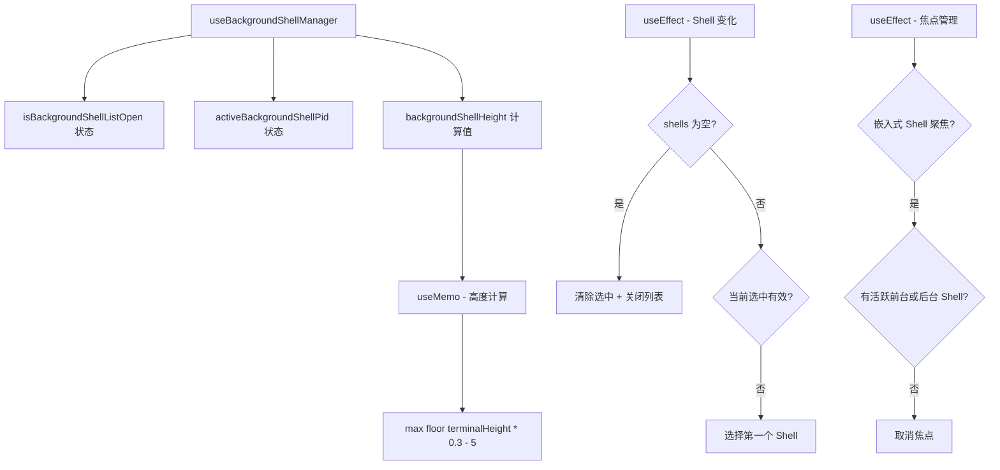

# useBackgroundShellManager.ts

> 管理后台 Shell 列表的展开/折叠、活跃进程选择和面板高度计算

## 概述

`useBackgroundShellManager` 是一个 React Hook，负责协调后台 Shell 进程面板的 UI 状态。它处理以下职责：

1. 维护后台 Shell 列表的展开/折叠状态。
2. 跟踪当前选中的后台 Shell 进程 PID。
3. 在 Shell 进程关闭时自动清理和重新选择。
4. 在没有可见 Shell 时自动取消嵌入式 Shell 焦点。
5. 根据终端高度计算后台 Shell 面板的显示高度（占终端 30%，最小 5 行）。

## 架构图（mermaid）

## 主要导出

| 导出名 | 类型 | 说明 |
|--------|------|------|
| `BackgroundShellManagerProps` | `interface` | Hook 参数接口 |
| `useBackgroundShellManager` | `(props: BackgroundShellManagerProps) => {...}` | 返回列表状态、选中 PID、面板高度及其 setter |

## 核心逻辑

1. 第一个 `useEffect` 监听 `backgroundShells` Map 的变化，当所有 Shell 关闭时重置状态；当当前选中的 Shell 不存在时自动选择第一个。
2. 第二个 `useEffect` 管理焦点一致性：如果嵌入式 Shell 处于聚焦状态但没有活跃的前台或后台 Shell，则自动取消焦点。
3. `backgroundShellHeight` 通过 `useMemo` 计算：当后台 Shell 可见且非空时为 `Math.max(Math.floor(terminalHeight * 0.3), 5)`，否则为 0。

## 内部依赖

| 依赖 | 路径 | 说明 |
|------|------|------|
| `BackgroundShell` | `./shellCommandProcessor.js` | 后台 Shell 类型定义 |

## 外部依赖

| 依赖 | 说明 |
|------|------|
| `react` | `useState`, `useEffect`, `useMemo` |
