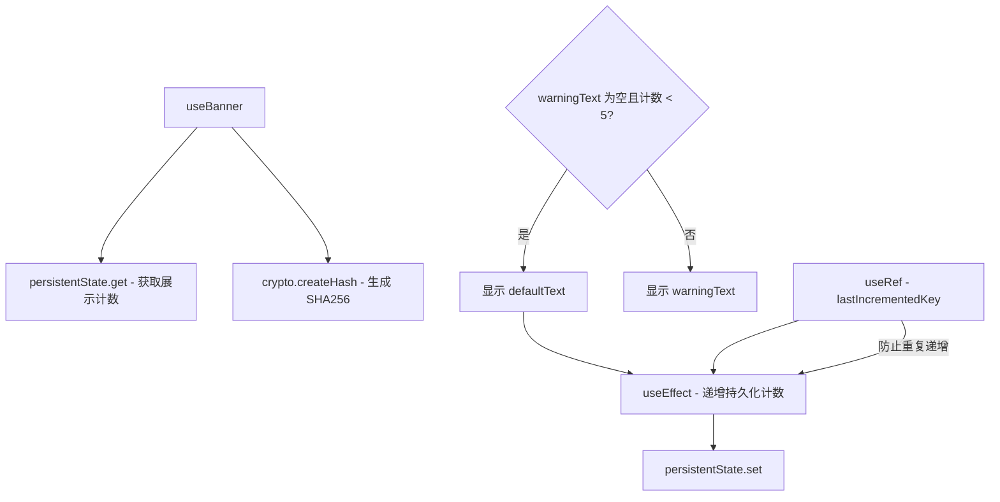

# useBanner.ts

> 管理横幅（Banner）的显示逻辑，包含展示次数限制和持久化计数

## 概述

`useBanner` 是一个 React Hook，用于控制 CLI 启动时横幅消息的显示。它实现了以下功能：

1. 使用 SHA-256 哈希标识不同的横幅内容。
2. 通过 `persistentState` 持久化存储每个横幅的展示次数。
3. 默认横幅最多展示 5 次（`DEFAULT_MAX_BANNER_SHOWN_COUNT`），超过后显示警告文本。
4. 如果存在 `warningText`（非空字符串），则直接显示警告而非默认横幅。
5. 支持 `\n` 转义为真实换行符。

## 架构图（mermaid）

## 主要导出

| 导出名 | 类型 | 说明 |
|--------|------|------|
| `useBanner` | `(bannerData: { defaultText: string, warningText: string }) => { bannerText: string }` | 返回应显示的横幅文本 |

## 核心逻辑

1. 使用 `persistentState.get('defaultBannerShownCount')` 获取所有横幅的展示计数映射。
2. 对 `defaultText` 计算 SHA-256 哈希作为唯一标识键。
3. 如果 `warningText` 为空且当前计数小于 5，则显示 `defaultText` 并在 `useEffect` 中递增计数。
4. `lastIncrementedKey` ref 防止同一 `defaultText` 在同一生命周期内被多次计数。
5. 返回的 `bannerText` 已将 `\\n` 替换为实际换行符 `\n`。

## 内部依赖

| 依赖 | 路径 | 说明 |
|------|------|------|
| `persistentState` | `../../utils/persistentState.js` | 跨会话的持久化状态存储 |

## 外部依赖

| 依赖 | 说明 |
|------|------|
| `react` | `useState`, `useEffect`, `useRef` |
| `node:crypto` | SHA-256 哈希计算 |
