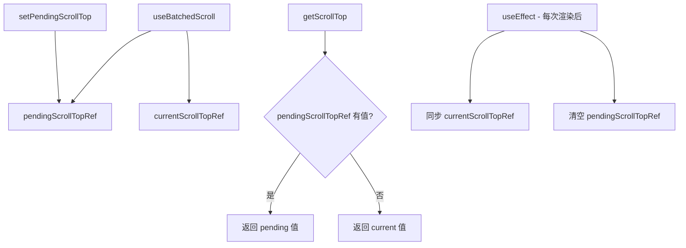

# useBatchedScroll.ts

> 在同一渲染周期内批量累积滚动操作，避免中间状态闪烁

## 概述

`useBatchedScroll` 是一个 React Hook，解决了在同一 tick（渲染周期）内多次滚动操作导致的状态不一致问题。它维护一个"待处理"的滚动位置 ref，在渲染完成后自动重置，使得多个滚动操作可以在同一帧内正确累积。

核心思想是：在 React 的 commit 阶段之前，所有滚动操作读取/写入的是 ref 中的待处理值；commit 之后（`useEffect` 无依赖），ref 被清空，下一帧恢复正常。

## 架构图（mermaid）

## 主要导出

| 导出名 | 类型 | 说明 |
|--------|------|------|
| `useBatchedScroll` | `(currentScrollTop: number) => { getScrollTop, setPendingScrollTop }` | 返回获取和设置滚动位置的函数 |

## 核心逻辑

1. `pendingScrollTopRef` 存储同一帧内累积的目标滚动位置，`currentScrollTopRef` 追踪已提交的真实位置。
2. `getScrollTop()`：优先返回 pending 值，否则返回当前值。使用 `useCallback([], [])` 确保函数引用稳定。
3. `setPendingScrollTop(newScrollTop)`：设置 pending 值。
4. 无依赖的 `useEffect` 在每次渲染后执行：同步 `currentScrollTopRef` 并清空 `pendingScrollTopRef`，确保下一帧的操作基于最新的已提交状态。

## 内部依赖

无。

## 外部依赖

| 依赖 | 说明 |
|------|------|
| `react` | `useRef`, `useEffect`, `useCallback` |
