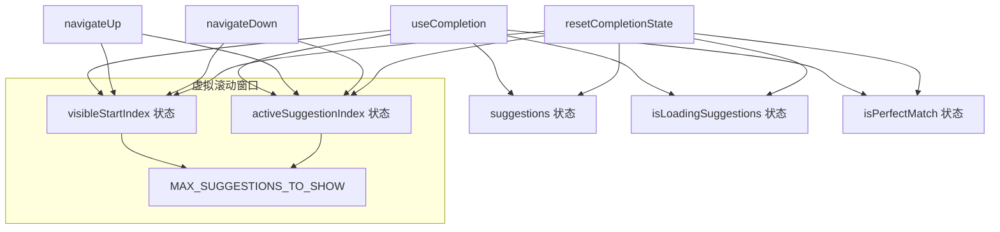

# useCompletion.ts

> 管理补全建议列表的状态、导航（上/下翻页）和滚动窗口

## 概述

`useCompletion` 是一个 React Hook，为各种补全场景（Slash 命令、@ 文件补全、Shell 命令补全等）提供统一的建议列表状态管理。它维护：

- 建议列表 (`suggestions`)
- 当前高亮索引 (`activeSuggestionIndex`)
- 可视区域起始索引 (`visibleStartIndex`)，实现虚拟滚动
- 加载状态 (`isLoadingSuggestions`)
- 精确匹配标记 (`isPerfectMatch`)

还提供了 `navigateUp`/`navigateDown` 导航函数，支持首尾循环和智能滚动窗口调整。

## 架构图（mermaid）

## 主要导出

| 导出名 | 类型 | 说明 |
|--------|------|------|
| `UseCompletionReturn` | `interface` | 返回值类型，包含所有状态和操作函数 |
| `useCompletion` | `() => UseCompletionReturn` | Hook 主函数 |

## 核心逻辑

1. **navigateUp**：索引减 1，到达 0 时循环到列表末尾。如果循环到最后一项且列表超过窗口大小，将 `visibleStartIndex` 设为列表末尾对应的窗口起始位置；如果索引滚动到窗口上方，`visibleStartIndex` 同步下移。
2. **navigateDown**：索引加 1，到达末尾时循环到 0。循环到第一项时窗口重置为 0；索引超出窗口下边界时，`visibleStartIndex` 向下滑动。
3. **resetCompletionState**：将所有状态恢复到初始值。
4. 所有导航函数使用 `useCallback` 缓存，依赖 `suggestions.length`。

## 内部依赖

| 依赖 | 路径 | 说明 |
|------|------|------|
| `MAX_SUGGESTIONS_TO_SHOW` | `../components/SuggestionsDisplay.js` | 可视窗口大小常量 |
| `Suggestion` | `../components/SuggestionsDisplay.js` | 建议项类型 |

## 外部依赖

| 依赖 | 说明 |
|------|------|
| `react` | `useState`, `useCallback` |
