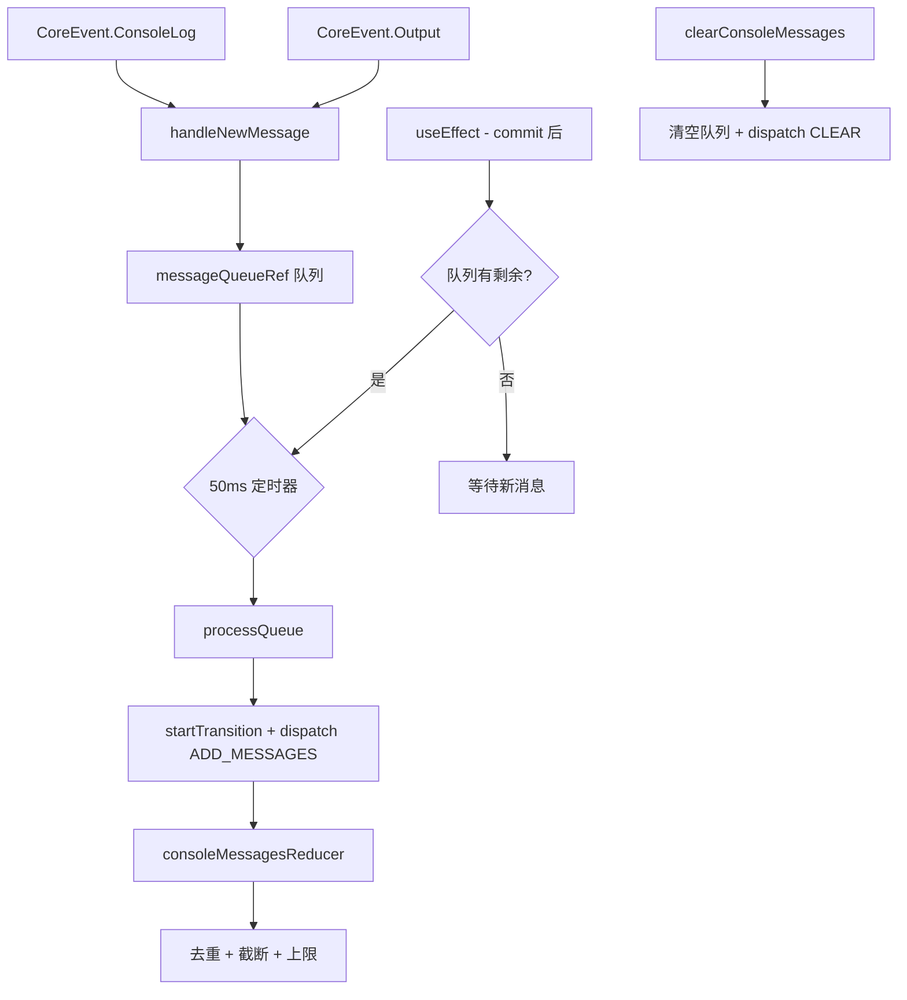

# useConsoleMessages.ts

> 收集并批量处理控制台日志和进程输出消息，支持去重和截断

## 概述

`useConsoleMessages` 是一个 React Hook，充当控制台消息的聚合器。它监听核心事件系统的 `ConsoleLog` 和 `Output` 事件，将消息收集到队列中，然后以 50ms 的批处理间隔合并到 React 状态中。

关键设计决策：
- **批处理**：避免高频消息导致 React 更新队列溢出。
- **去重**：连续相同消息合并为一条，增加 `count` 计数。
- **截断**：单条消息超过 10000 字符时截断。
- **上限**：最多保留 1000 条消息，超出时丢弃最旧的。
- **有序处理**：使用 `isProcessingRef` 确保不会出现并发更新。

## 架构图（mermaid）

## 主要导出

| 导出名 | 类型 | 说明 |
|--------|------|------|
| `UseConsoleMessagesReturn` | `interface` | `{ consoleMessages, clearConsoleMessages }` |
| `useConsoleMessages` | `() => UseConsoleMessagesReturn` | 返回消息列表和清除函数 |

## 核心逻辑

1. `useReducer` + `consoleMessagesReducer` 管理消息数组，支持 `ADD_MESSAGES` 和 `CLEAR` 操作。
2. `handleNewMessage` 将消息推入 `messageQueueRef` 队列，非处理中时启动 50ms 定时器。
3. `processQueue` 在 `startTransition` 中批量 dispatch，降低 React 渲染优先级。
4. 渲染完成后的 `useEffect` 检查队列是否有剩余消息，有则继续处理。
5. `isProcessingRef` 标志位防止并发的 `processQueue` 调用。
6. 事件监听和定时器在组件卸载时正确清理。

## 内部依赖

| 依赖 | 路径 | 说明 |
|------|------|------|
| `ConsoleMessageItem` | `../types.js` | 控制台消息项类型 |

## 外部依赖

| 依赖 | 说明 |
|------|------|
| `react` | `useCallback`, `useEffect`, `useReducer`, `useRef`, `startTransition` |
| `@google/gemini-cli-core` | `coreEvents`, `CoreEvent`, `ConsoleLogPayload` |
