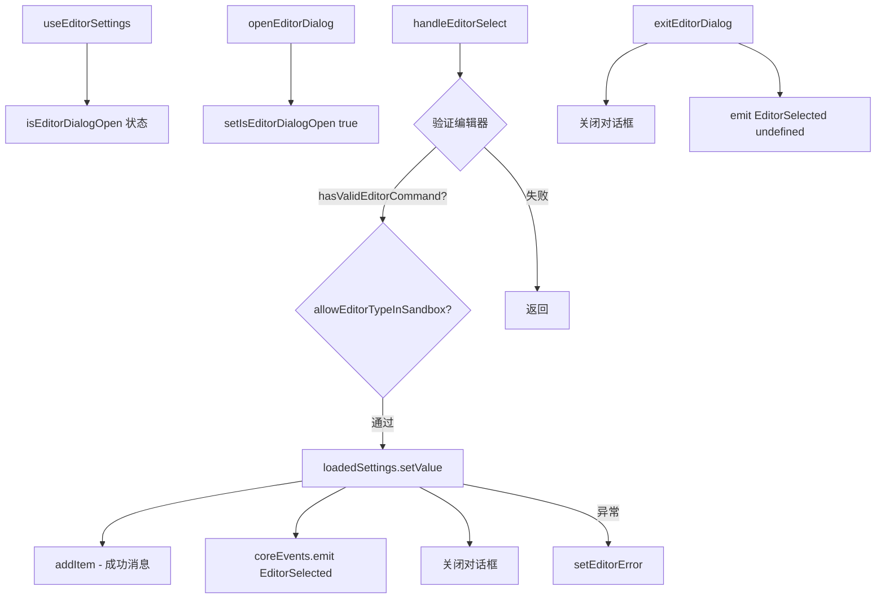

# useEditorSettings.ts

> 管理首选编辑器的选择对话框和设置持久化

## 概述

`useEditorSettings` 是一个 React Hook，用于管理用户首选代码编辑器的设置流程。它提供：

1. 编辑器选择对话框的打开/关闭状态管理。
2. 编辑器类型验证（检查编辑器命令是否有效、是否允许在沙箱中使用）。
3. 将选择的编辑器偏好持久化到指定的设置范围（用户级/项目级）。
4. 通过核心事件系统通知其他组件编辑器已被选中。

## 架构图（mermaid）

## 主要导出

| 导出名 | 类型 | 说明 |
|--------|------|------|
| `useEditorSettings` | `(loadedSettings, setEditorError, addItem) => UseEditorSettingsReturn` | 返回对话框状态和操作函数 |

## 核心逻辑

1. `handleEditorSelect` 先验证编辑器类型：`hasValidEditorCommand` 检查命令是否可执行，`allowEditorTypeInSandbox` 检查沙箱兼容性。
2. 验证通过后，调用 `loadedSettings.setValue` 将偏好写入 `SettingPaths.General.PreferredEditor`。
3. 成功时通过 `addItem` 添加信息消息，并通过 `coreEvents.emit(CoreEvent.EditorSelected)` 通知系统。
4. `exitEditorDialog` 关闭对话框并发送 `EditorSelected` 事件（editor 为 undefined）。

## 内部依赖

| 依赖 | 路径 | 说明 |
|------|------|------|
| `LoadableSettingScope`, `LoadedSettings` | `../../config/settings.js` | 设置作用域和加载的设置类型 |
| `MessageType` | `../types.js` | 消息类型 |
| `UseHistoryManagerReturn` | `./useHistoryManager.js` | addItem 类型 |
| `SettingPaths` | `../../config/settingPaths.js` | 设置路径常量 |

## 外部依赖

| 依赖 | 说明 |
|------|------|
| `react` | `useState`, `useCallback` |
| `@google/gemini-cli-core` | `EditorType`, `allowEditorTypeInSandbox`, `hasValidEditorCommand`, `getEditorDisplayName`, `coreEvents`, `CoreEvent` |
