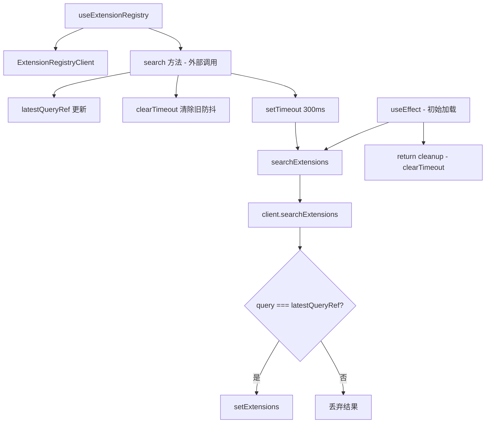

# useExtensionRegistry.ts

> 从扩展注册表搜索扩展，支持防抖查询和竞态条件处理

## 概述

`useExtensionRegistry` 是一个 React Hook，封装了与扩展注册表客户端的交互逻辑。它提供：

1. 初始加载时自动执行搜索。
2. 300ms 防抖搜索（避免频繁请求）。
3. 通过 `latestQueryRef` 处理竞态条件（仅更新最新查询的结果）。
4. 使用 `useMemo` 缓存 `ExtensionRegistryClient` 实例。

## 架构图（mermaid）

## 主要导出

| 导出名 | 类型 | 说明 |
|--------|------|------|
| `UseExtensionRegistryResult` | `interface` | `{ extensions, loading, error, search }` |
| `useExtensionRegistry` | `(initialQuery?, registryURI?) => UseExtensionRegistryResult` | 返回扩展列表、状态和搜索函数 |

## 核心逻辑

1. `ExtensionRegistryClient` 通过 `useMemo` 创建，依赖 `registryURI`。
2. `searchExtensions` 是实际执行搜索的异步函数，通过 `latestQueryRef` 防止过期结果覆盖新结果。
3. `search` 是暴露给外部的防抖版搜索：更新 ref、清除旧定时器、设置 300ms 延迟。
4. `setExtensions` 使用函数式更新，通过 ID 比较判断结果是否真正变化，避免不必要的重渲染。
5. 初始加载时立即执行一次搜索（无防抖），组件卸载时清理定时器。

## 内部依赖

| 依赖 | 路径 | 说明 |
|------|------|------|
| `ExtensionRegistryClient` | `../../config/extensionRegistryClient.js` | 扩展注册表 API 客户端 |
| `RegistryExtension` | `../../config/extensionRegistryClient.js` | 扩展数据类型 |

## 外部依赖

| 依赖 | 说明 |
|------|------|
| `react` | `useState`, `useEffect`, `useMemo`, `useCallback`, `useRef` |
