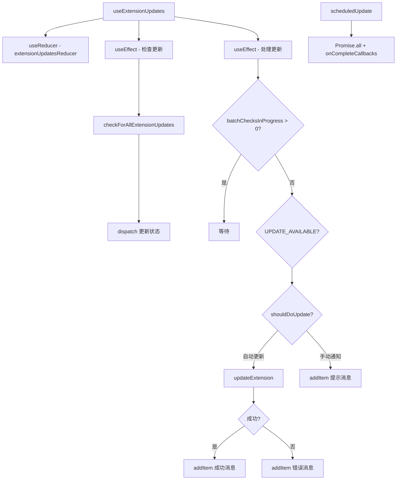

# useExtensionUpdates.ts

> 检查扩展更新并管理自动/手动更新流程和确认请求队列

## 概述

`useExtensionUpdates` 是一个 React Hook，负责扩展更新的完整生命周期管理。它包含两个导出的 Hook：

1. **`useConfirmUpdateRequests`**：管理更新确认请求的队列，使用 `useReducer` 维护请求列表，支持添加和移除。
2. **`useExtensionUpdates`**：核心 Hook，处理以下流程：
   - 自动检查所有扩展的更新状态。
   - 区分自动更新（`autoUpdate` 标志）和手动更新（通过 `/extensions update` 命令触发）。
   - 执行更新并通过 `addItem` 通知用户结果。
   - 对未设置自动更新的扩展，仅通知有更新可用。

## 架构图（mermaid）

## 主要导出

| 导出名 | 类型 | 说明 |
|--------|------|------|
| `useConfirmUpdateRequests` | `() => { addConfirmUpdateExtensionRequest, confirmUpdateExtensionRequests, dispatchConfirmUpdateExtensionRequests }` | 更新确认请求队列管理 |
| `useExtensionUpdates` | `(extensionManager, addItem, enableExtensionReloading) => { extensionsUpdateState, extensionsUpdateStateInternal, dispatchExtensionStateUpdate }` | 扩展更新状态管理 |

## 核心逻辑

1. 第一个 `useEffect`：筛选出状态为 UNKNOWN 的扩展，调用 `checkForAllExtensionUpdates` 批量检查。
2. 第二个 `useEffect`：等待所有批量检查完成后，遍历 UPDATE_AVAILABLE 状态的扩展：
   - `shouldDoUpdate` 逻辑：如果有 `scheduledUpdate`，检查是否在更新列表中；否则检查 `autoUpdate` 标志。
   - 需要更新的扩展调用 `updateExtension`，成功/失败通过 `addItem` 通知。
   - 仅需通知的扩展标记为 `notified`，批量生成提示消息。
3. `scheduledUpdate` 场景：等待所有 Promise 完成后触发 `onCompleteCallbacks`。
4. `extensionsUpdateStateComputed` 通过 `useMemo` 将内部详细状态映射为简化的 `ExtensionUpdateState` Map。

## 内部依赖

| 依赖 | 路径 | 说明 |
|------|------|------|
| `ExtensionUpdateState`, `extensionUpdatesReducer` | `../state/extensions.js` | 更新状态 reducer |
| `UseHistoryManagerReturn` | `./useHistoryManager.js` | addItem 类型 |
| `MessageType`, `ConfirmationRequest` | `../types.js` | 消息和确认类型 |
| `checkForAllExtensionUpdates`, `updateExtension` | `../../config/extensions/update.js` | 更新检查和执行函数 |
| `ExtensionUpdateInfo` | `../../config/extension.js` | 更新信息类型 |
| `ExtensionManager` | `../../config/extension-manager.js` | 扩展管理器 |

## 外部依赖

| 依赖 | 说明 |
|------|------|
| `react` | `useCallback`, `useEffect`, `useMemo`, `useReducer` |
| `@google/gemini-cli-core` | `debugLogger`, `checkExhaustive`, `getErrorMessage`, `GeminiCLIExtension` |
