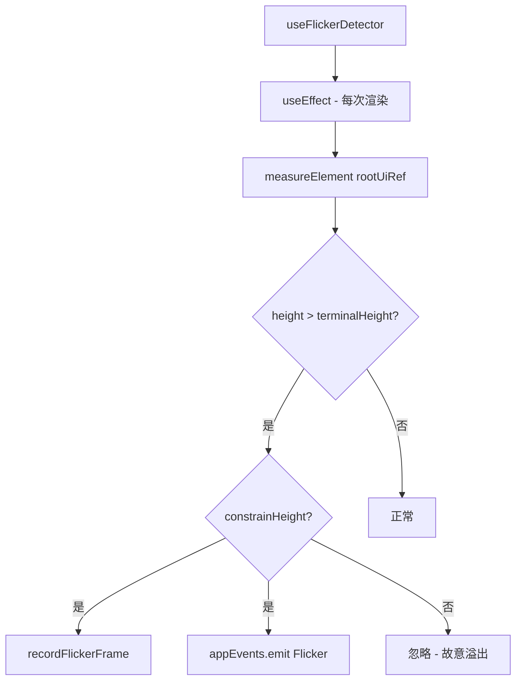

# useFlickerDetector.ts

> 检测 UI 渲染是否超出终端高度，记录闪烁帧并发出事件

## 概述

`useFlickerDetector` 是一个调试用途的 React Hook，在每次渲染后测量根 UI 元素的实际高度，如果超过终端高度，说明发生了"闪烁"（Flicker）--这通常是渲染 bug 的信号。

检测到闪烁时，它会：
1. 调用 `recordFlickerFrame(config)` 记录遥测数据。
2. 通过 `appEvents.emit(AppEvent.Flicker)` 发出事件供其他组件响应。

如果 `constrainHeight` 为 false（即 UI 故意溢出），则不报告闪烁。

## 架构图（mermaid）

## 主要导出

| 导出名 | 类型 | 说明 |
|--------|------|------|
| `useFlickerDetector` | `(rootUiRef: RefObject<DOMElement \| null>, terminalHeight: number) => void` | 闪烁检测 Hook |

## 核心逻辑

1. 使用 Ink 的 `measureElement` API 测量 `rootUiRef.current` 的实际渲染高度。
2. 如果 `measurement.height > terminalHeight` 且 `constrainHeight` 为 true，则记录闪烁。
3. `useEffect` 没有依赖数组，因此每次渲染后都会执行检测。

## 内部依赖

| 依赖 | 路径 | 说明 |
|------|------|------|
| `useConfig` | `../contexts/ConfigContext.js` | 获取 Config 对象 |
| `useUIState` | `../contexts/UIStateContext.js` | 获取 constrainHeight 状态 |
| `appEvents`, `AppEvent` | `../../utils/events.js` | 应用级事件系统 |

## 外部依赖

| 依赖 | 说明 |
|------|------|
| `react` | `useEffect` |
| `ink` | `DOMElement`, `measureElement` |
| `@google/gemini-cli-core` | `recordFlickerFrame` |
