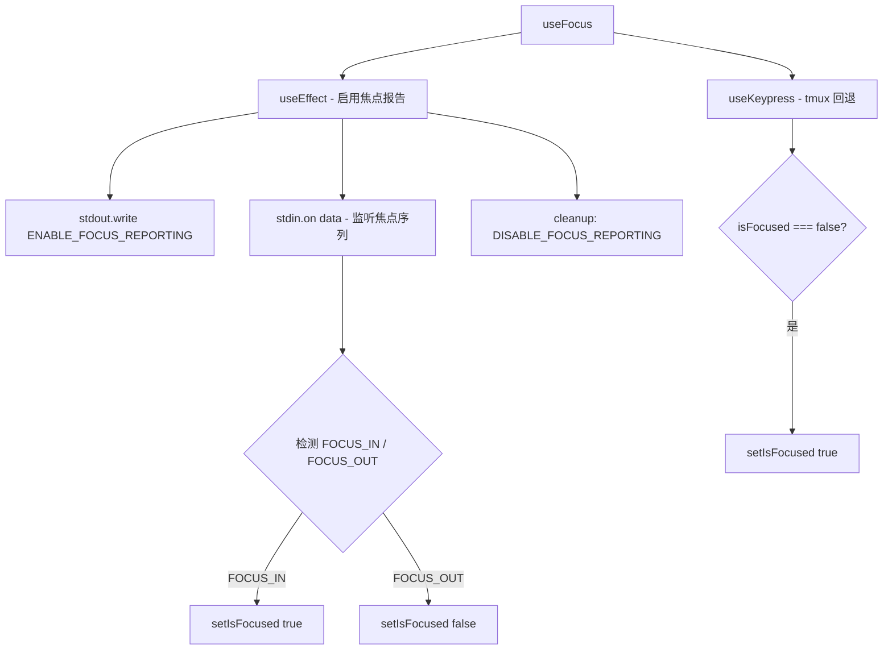

# useFocus.ts

> 跟踪终端窗口的焦点/失焦状态，支持 ANSI 焦点报告协议

## 概述

`useFocus` 是一个 React Hook，利用终端的 ANSI 焦点报告协议（`\x1b[?1004h`）检测终端窗口是否处于焦点状态。它还提供了一个兼容 tmux 的回退机制：如果用户在失焦状态下按键，则自动视为已获得焦点。

Hook 管理两个状态：
- `isFocused`：当前是否聚焦。
- `hasReceivedFocusEvent`：是否曾收到过焦点事件（用于区分是否支持焦点协议）。

## 架构图（mermaid）

## 主要导出

| 导出名 | 类型 | 说明 |
|--------|------|------|
| `ENABLE_FOCUS_REPORTING` | `string` | ANSI 转义序列：启用焦点报告 |
| `DISABLE_FOCUS_REPORTING` | `string` | ANSI 转义序列：禁用焦点报告 |
| `FOCUS_IN` | `string` | ANSI 焦点获得序列 `\x1b[I` |
| `FOCUS_OUT` | `string` | ANSI 焦点失去序列 `\x1b[O` |
| `useFocus` | `() => { isFocused: boolean, hasReceivedFocusEvent: boolean }` | 返回焦点状态 |

## 核心逻辑

1. 组件挂载时通过 `stdout.write` 启用终端焦点报告，卸载时禁用。
2. 监听 `stdin` 的 `data` 事件，在数据中查找最后出现的 `FOCUS_IN` 和 `FOCUS_OUT` 序列，以最后出现的为准。
3. `useKeypress` 作为 tmux 兼容回退：如果 `isFocused` 为 false 时检测到键盘输入，则强制设为 true。

## 内部依赖

| 依赖 | 路径 | 说明 |
|------|------|------|
| `useKeypress` | `./useKeypress.js` | 键盘事件监听 |

## 外部依赖

| 依赖 | 说明 |
|------|------|
| `react` | `useEffect`, `useState` |
| `ink` | `useStdin`, `useStdout` |
