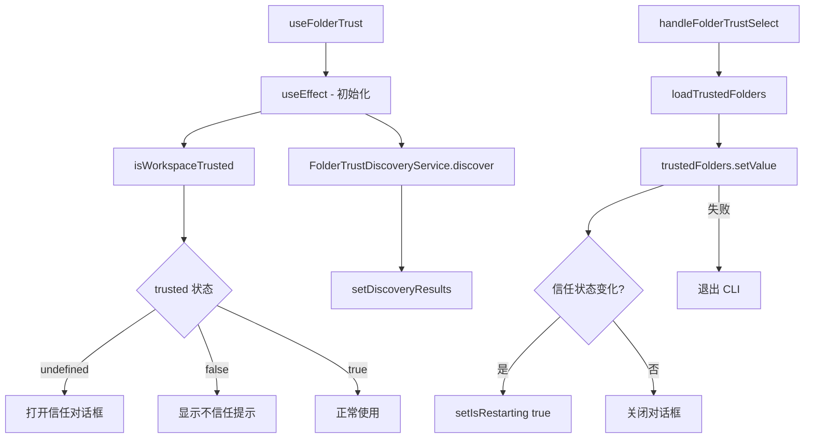

# useFolderTrust.ts

> 管理工作区文件夹信任状态，包含信任对话框、发现服务和信任变更重启逻辑

## 概述

`useFolderTrust` 是一个 React Hook，处理 Gemini CLI 的文件夹信任（Folder Trust）安全机制。首次访问未知文件夹时，CLI 需要用户明确选择信任级别。该 Hook 负责：

1. 检测当前工作区的信任状态。
2. 显示/隐藏信任选择对话框。
3. 使用 `FolderTrustDiscoveryService` 发现文件夹的安全信息。
4. 持久化用户的信任选择。
5. 信任状态变更时触发应用重启。
6. 对不信任的文件夹显示提示消息。
7. 在 Headless 模式下跳过对话框。

## 架构图（mermaid）

## 主要导出

| 导出名 | 类型 | 说明 |
|--------|------|------|
| `useFolderTrust` | `(settings, onTrustChange, addItem) => { isTrusted, isFolderTrustDialogOpen, discoveryResults, handleFolderTrustSelect, isRestarting }` | 返回信任状态和操作函数 |

## 核心逻辑

1. `useEffect` 初始化：调用 `isWorkspaceTrusted(settings.merged)` 获取信任状态，未确定时触发发现服务和对话框。
2. `FolderTrustDiscoveryService.discover(process.cwd())` 异步获取文件夹安全信息。
3. `handleFolderTrustSelect`：将 `FolderTrustChoice` 映射为 `TrustLevel`，写入持久化存储。
4. 若保存失败，延迟 100ms 后执行清理并以 `FATAL_CONFIG_ERROR` 退出。
5. 信任状态变更（trusted -> untrusted 或反之）时设置 `isRestarting`，触发应用重启流程。
6. Headless 模式下直接设置信任状态，不显示对话框。

## 内部依赖

| 依赖 | 路径 | 说明 |
|------|------|------|
| `LoadedSettings` | `../../config/settings.js` | 设置类型 |
| `FolderTrustChoice` | `../components/FolderTrustDialog.js` | 用户选择项类型 |
| `loadTrustedFolders`, `TrustLevel`, `isWorkspaceTrusted` | `../../config/trustedFolders.js` | 信任文件夹管理 |
| `HistoryItemWithoutId`, `MessageType` | `../types.js` | 消息类型 |
| `runExitCleanup` | `../../utils/cleanup.js` | 退出清理 |

## 外部依赖

| 依赖 | 说明 |
|------|------|
| `react` | `useState`, `useCallback`, `useEffect`, `useRef` |
| `node:process` | `process.cwd()`, `process.exit()` |
| `@google/gemini-cli-core` | `coreEvents`, `ExitCodes`, `isHeadlessMode`, `FolderTrustDiscoveryService`, `FolderDiscoveryResults` |
