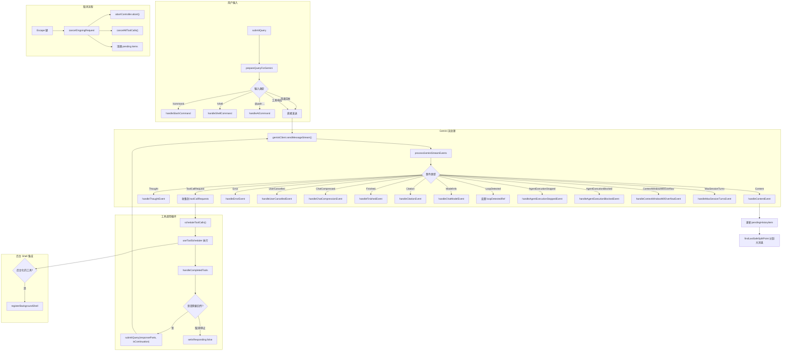

# useGeminiStream.ts

> 核心 React Hook（约 1939 行），管理 Gemini API 的完整流式交互生命周期，包括用户输入处理、流事件调度、工具调用编排、取消控制和后台 Shell 集成。

## 概述

`useGeminiStream.ts` 是 Gemini CLI 中最核心的 Hook，作为整个 AI 交互循环的"大脑"。它串联了用户输入 -> 命令路由 -> API 调用 -> 流事件处理 -> 工具执行 -> 结果回传 -> 下一轮对话的完整链路。主要职责包括：

1. **输入路由**：将用户输入分流到斜杠命令处理器、Shell 命令处理器、`@` 命令处理器或直接发送给 Gemini API。
2. **流事件处理**：处理 Gemini API 返回的 15+ 种事件类型（内容、思考、工具调用、错误、压缩、引用等）。
3. **工具调用生命周期**：通过 `useToolScheduler` 管理工具的调度、执行、批次提交、后台化。
4. **取消控制**：支持 Escape 键取消正在进行的请求和工具调用。
5. **状态管理**：维护流式状态（Idle/Responding/WaitingForConfirmation）、pending history items、thought summaries。
6. **审批模式切换**：处理 YOLO/AUTO_EDIT/PLAN 模式切换时自动审批待确认的工具调用。
7. **循环检测**：检测模型工具调用循环并提供用户确认交互。
8. **检查点保存**：在编辑工具等待审批时保存 Git 检查点。

## 架构图

## 主要导出

| 导出项 | 类型 | 说明 |
|--------|------|------|
| `useGeminiStream` | React Hook | Gemini 流式交互核心 Hook |

### Hook 参数

| 参数 | 类型 | 说明 |
|------|------|------|
| `geminiClient` | `GeminiClient` | Gemini API 客户端 |
| `history` | `HistoryItem[]` | 当前会话历史 |
| `addItem` | `UseHistoryManagerReturn['addItem']` | 添加历史项 |
| `config` | `Config` | 全局配置 |
| `settings` | `LoadedSettings` | 用户设置 |
| `onDebugMessage` | `(message: string) => void` | 调试消息回调 |
| `handleSlashCommand` | 函数 | 斜杠命令处理器 |
| `shellModeActive` | `boolean` | 是否处于 Shell 模式 |
| `getPreferredEditor` | `() => EditorType \| undefined` | 获取用户首选编辑器 |
| `onAuthError` | `(error: string) => void` | 认证错误回调 |
| `performMemoryRefresh` | `() => Promise<void>` | 刷新记忆的回调 |
| `modelSwitchedFromQuotaError` | `boolean` | 是否因配额错误切换了模型 |
| `setModelSwitchedFromQuotaError` | setter | 设置配额错误模型切换状态 |
| `onCancelSubmit` | `(shouldRestorePrompt?) => void` | 取消提交回调 |
| `setShellInputFocused` | `(value: boolean) => void` | 设置 Shell 输入焦点 |
| `terminalWidth` | `number` | 终端宽度 |
| `terminalHeight` | `number` | 终端高度 |
| `isShellFocused` | `boolean?` | Shell 是否获得焦点 |
| `consumeUserHint` | `() => string \| null` | 消费用户的引导提示 |

### Hook 返回值

| 字段 | 类型 | 说明 |
|------|------|------|
| `streamingState` | `StreamingState` | 当前流状态：`Idle` / `Responding` / `WaitingForConfirmation` |
| `submitQuery` | `(query, options?, prompt_id?) => Promise<void>` | 提交查询到 Gemini |
| `initError` | `string \| null` | 初始化错误 |
| `pendingHistoryItems` | `HistoryItemWithoutId[]` | 正在流式处理中的历史项列表 |
| `thought` | `ThoughtSummary \| null` | 当前思考摘要 |
| `cancelOngoingRequest` | `() => void` | 取消当前请求 |
| `pendingToolCalls` | `TrackedToolCall[]` | 当前批次的工具调用列表 |
| `handleApprovalModeChange` | `(mode: ApprovalMode) => Promise<void>` | 处理审批模式变更 |
| `activePtyId` | `number \| undefined` | 当前活跃的 PTY ID |
| `loopDetectionConfirmationRequest` | 对象或 `null` | 循环检测确认请求 |
| `lastOutputTime` | `number` | 最后一次输出时间 |
| `backgroundShellCount` | `number` | 后台 Shell 数量 |
| `isBackgroundShellVisible` | `boolean` | 后台 Shell 面板是否可见 |
| `toggleBackgroundShell` | `() => void` | 切换后台 Shell 显示 |
| `backgroundCurrentShell` | `() => void` | 后台化当前 Shell |
| `backgroundShells` | `Map` | 后台 Shell 映射 |
| `dismissBackgroundShell` | `(pid) => Promise<void>` | 关闭后台 Shell |
| `retryStatus` | `RetryAttemptPayload \| null` | 重试状态 |

## 核心逻辑

### `submitQuery(query, options?, prompt_id?)`

主提交函数，包裹在 `runInDevTraceSpan` 中用于性能追踪：

1. 防止重复提交（检查 `isRespondingRef` 和 `streamingState`）。
2. 重置配额错误标志和工具错误计数器（仅非续接请求）。
3. 创建 `AbortController` 用于取消控制。
4. 调用 `prepareQueryForGemini` 进行输入路由和预处理。
5. 记录遥测日志（`logUserPrompt`）和会话统计。
6. 调用 `geminiClient.sendMessageStream` 发起流式请求。
7. 调用 `processGeminiStreamEvents` 处理所有流事件。
8. 处理循环检测和用户确认对话框。
9. 异常处理：`UnauthorizedError` -> 认证对话框，`ValidationRequiredError` -> 跳过，其他 -> 错误消息。

### `prepareQueryForGemini(query, userMessageTimestamp, abortSignal, prompt_id)`

输入预处理和路由：
- 斜杠命令 -> `handleSlashCommand`（可能返回 `schedule_tool` / `submit_prompt` / `handled`）
- Shell 模式 -> `handleShellCommand`
- `@` 命令 -> `handleAtCommand`
- 普通文本 -> 直接添加用户消息到历史并返回

### `processGeminiStreamEvents(stream, userMessageTimestamp, signal)`

遍历异步事件流，按类型分发到对应的事件处理器。关键行为：
- **Content 事件**：累积到 `geminiMessageBuffer`，调用 `findLastSafeSplitPoint` 在 Markdown 安全边界处分割大消息以优化渲染性能。
- **ToolCallRequest 事件**：收集到数组中，流结束后批量调用 `scheduleToolCalls`。
- **Thought 事件**：在非 Thought 事件到来时自动清除之前的 Thought 显示。

### `handleCompletedTools(completedToolCalls)`

工具完成后的回传逻辑：
1. 过滤出已完成且有 `responseParts` 的工具调用。
2. 标记客户端发起的工具为已提交。
3. 检测 `save_memory` 工具的成功调用并触发记忆刷新。
4. 检测后台化的工具并注册后台 Shell。
5. 处理 `STOP_EXECUTION` 错误类型（立即终止）。
6. 若全部取消，手动添加 `functionResponse` 到对话历史。
7. 注入用户引导提示（`consumeUserHint`）。
8. 调用 `submitQuery(responseParts, { isContinuation: true })` 继续对话。

### `cancelOngoingRequest()`

取消逻辑：
1. 判断是否为完全取消（没有任何工具已产生结果）。
2. 触发 `abortController.abort()` 中断所有异步操作。
3. 调用 `cancelAllToolCalls` 清理工具队列。
4. 处理 pending history item（Shell 命令标记为 Cancelled，其他直接添加）。
5. 完全取消时显示"Request cancelled."消息。

### `handleApprovalModeChange(newApprovalMode)`

审批模式变更处理：
- 从 PLAN 模式退出时，向模型添加退出提示。
- 切换到 YOLO/AUTO_EDIT 模式时，自动审批所有（或编辑类）待确认工具调用。

### 检查点保存

通过 `useEffect` 监听 `toolCalls`，当有编辑工具处于 `AwaitingApproval` 状态时：
1. 调用 `processRestorableToolCalls` 生成 Git 检查点。
2. 将检查点文件写入项目临时目录。

### 内部辅助函数

- `calculateStreamingState(isResponding, toolCalls)`：根据工具调用状态和响应标志计算 `StreamingState`。
- `getBackgroundedToolInfo(toolCall)`：从已完成的工具调用中提取后台化信息（pid、command、initialOutput）。
- `showCitations(settings)`：根据设置决定是否显示引用。

## 内部依赖

| 模块 | 导入项 | 用途 |
|------|--------|------|
| `../types.js` | 多种历史记录和 UI 类型 | 类型定义 |
| `../utils/commandUtils.js` | `isAtCommand`, `isSlashCommand` | 命令类型判断 |
| `./shellCommandProcessor.js` | `useShellCommandProcessor` | Shell 命令处理 |
| `./atCommandProcessor.js` | `handleAtCommand` | `@` 命令处理 |
| `../utils/markdownUtilities.js` | `findLastSafeSplitPoint` | Markdown 安全分割点 |
| `../utils/inlineThinkingMode.js` | `getInlineThinkingMode` | 思考模式设置 |
| `./useStateAndRef.js` | `useStateAndRef` | 同步 state 和 ref |
| `./useHistoryManager.js` | `UseHistoryManagerReturn` | 历史管理器类型 |
| `./useLogger.js` | `useLogger` | 日志记录 |
| `../constants.js` | `SHELL_COMMAND_NAME` | Shell 命令名 |
| `./toolMapping.js` | `mapToDisplay` | 工具调用到显示的映射 |
| `./useToolScheduler.js` | `useToolScheduler` 及类型 | 工具调度 |
| `../semantic-colors.js` | `theme` | 主题颜色 |
| `../utils/borderStyles.js` | `getToolGroupBorderAppearance` | 工具组边框样式 |
| `../contexts/SessionContext.js` | `useSessionStats` | 会话统计 |
| `./useKeypress.js` | `useKeypress` | 键盘事件监听 |
| `../../config/settings.js` | `LoadedSettings` | 设置类型 |

## 外部依赖

| 模块 | 导入项 | 用途 |
|------|--------|------|
| `react` | `useState`, `useRef`, `useCallback`, `useEffect`, `useMemo` | React Hook 基础设施 |
| `@google/genai` | `Part`, `PartListUnion`, `FinishReason` | Gemini API 类型和枚举 |
| `@google/gemini-cli-core` | 大量导入（`GeminiEventType`, `getErrorMessage`, `MessageSenderType`, `logUserPrompt`, `UnauthorizedError`, `ApprovalMode`, `parseAndFormatApiError`, `ToolConfirmationOutcome`, `tokenLimit`, `debugLogger`, `EDIT_TOOL_NAMES`, `ASK_USER_TOOL_NAME`, `processRestorableToolCalls`, `recordToolCallInteractions`, `CoreToolCallStatus`, `buildUserSteeringHintPrompt`, `GeminiCliOperation`, `getPlanModeExitMessage`, `isBackgroundExecutionData` 等） | 核心业务逻辑和工具 |
| `node:fs` | `promises as fs` | 写入检查点文件 |
| `node:path` | `path` | 路径拼接 |
