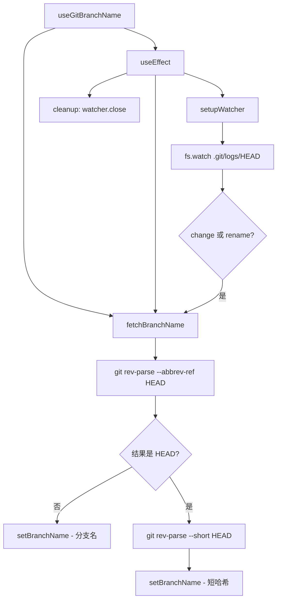

# useGitBranchName.ts

> 获取并实时监控当前 Git 分支名，通过文件系统 watcher 自动更新

## 概述

`useGitBranchName` 是一个 React Hook，返回当前工作目录的 Git 分支名称。它通过两种机制保持分支名的实时性：

1. **初始获取**：使用 `git rev-parse --abbrev-ref HEAD` 获取分支名。如果处于 detached HEAD 状态，则退回到 `git rev-parse --short HEAD` 获取短哈希。
2. **文件监听**：监控 `.git/logs/HEAD` 文件的变化（`change` 或 `rename` 事件），在 Git 操作（checkout、merge 等）时自动重新获取分支名。

## 架构图（mermaid）

## 主要导出

| 导出名 | 类型 | 说明 |
|--------|------|------|
| `useGitBranchName` | `(cwd: string) => string \| undefined` | 返回当前分支名或 undefined |

## 核心逻辑

1. `fetchBranchName` 通过 `spawnAsync` 调用 Git 命令，处理正常分支和 detached HEAD 两种情况。
2. `setupWatcher` 先检查 `.git/logs/HEAD` 是否存在（新仓库可能不存在），然后设置 `fs.watch`。
3. `cancelled` 标志位防止异步操作在组件卸载后更新状态。
4. 所有错误静默处理--Git 不可用时返回 `undefined`。

## 内部依赖

无。

## 外部依赖

| 依赖 | 说明 |
|------|------|
| `react` | `useState`, `useEffect`, `useCallback` |
| `@google/gemini-cli-core` | `spawnAsync` - 异步进程执行 |
| `node:fs` | `FSWatcher`, `watch`, `constants` |
| `node:fs/promises` | `access` - 文件存在性检查 |
| `node:path` | 路径拼接 |
