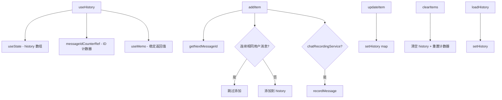

# useHistoryManager.ts

> 管理聊天历史记录的增删改查，支持唯一 ID 生成、去重和录制服务集成

## 概述

`useHistory`（注意：函数名与文件名略有不同）是核心的聊天历史管理 Hook。它提供：

1. **历史记录状态管理**：维护 `HistoryItem[]` 数组。
2. **唯一 ID 生成**：基于时间戳 + 自增计数器生成消息 ID。
3. **添加消息**：`addItem` 支持去重（防止连续相同的用户消息）。
4. **更新消息**：`updateItem` 支持对象更新和函数式更新（已标记为 `@deprecated`，因为 `<Static />` 渲染模式下直接更新不理想）。
5. **录制集成**：自动将 info/warning/error 类型的消息记录到 `ChatRecordingService`。
6. **会话恢复**：`loadHistory` 用于加载已有的历史记录。

## 架构图（mermaid）

## 主要导出

| 导出名 | 类型 | 说明 |
|--------|------|------|
| `UseHistoryManagerReturn` | `interface` | `{ history, addItem, updateItem, clearItems, loadHistory }` |
| `useHistory` | `({ chatRecordingService?, initialItems? }) => UseHistoryManagerReturn` | 历史管理 Hook |

## 核心逻辑

1. `getNextMessageId(baseTimestamp)`：每次调用递增 `messageIdCounterRef`，生成 `baseTimestamp + counter` 作为唯一 ID。
2. `addItem` 检查最后一条消息是否与新消息完全相同（type + text），相同则不添加。
3. `addItem` 的 `isResuming` 参数控制是否跳过录制（恢复会话时不重复录制）。
4. 录制逻辑根据消息类型分发：compression/info 记为 info，warning/error 分别记录，user/gemini 由核心层处理。
5. `useMemo` 包裹返回值，确保在依赖不变时引用稳定。

## 内部依赖

| 依赖 | 路径 | 说明 |
|------|------|------|
| `HistoryItem` | `../types.js` | 历史项类型 |

## 外部依赖

| 依赖 | 说明 |
|------|------|
| `react` | `useState`, `useRef`, `useCallback`, `useMemo` |
| `@google/gemini-cli-core` | `ChatRecordingService` 类型 |
