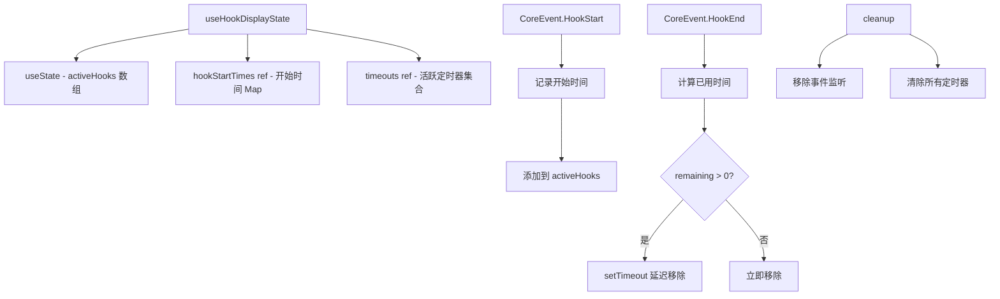

# useHookDisplayState.ts

> 跟踪 Gemini Hooks（生命周期钩子）的执行状态，支持最短显示时长保证

## 概述

`useHookDisplayState` 是一个 React Hook，监听核心事件系统中的 `HookStart` 和 `HookEnd` 事件，维护当前活跃的钩子列表。它的关键特性是"最短显示时长保证"：即使钩子执行很快完成，UI 也会至少显示 `WARNING_PROMPT_DURATION_MS` 的时长，避免闪烁。

该 Hook 使用独立的 `ref` 跟踪每个钩子的开始时间（支持同名钩子的并发执行），并通过 FIFO 栈配对 start/end 事件。

## 架构图（mermaid）

## 主要导出

| 导出名 | 类型 | 说明 |
|--------|------|------|
| `useHookDisplayState` | `() => ActiveHook[]` | 返回当前活跃的钩子列表 |

## 核心逻辑

1. **HookStart 处理**：使用 `hookName:eventName` 作为键，将开始时间推入 `hookStartTimes` Map 中的数组（支持同类钩子并发）。
2. **HookEnd 处理**：从时间数组中 `shift()` 取出最早的开始时间（FIFO），计算 `remaining = WARNING_PROMPT_DURATION_MS - elapsed`。
3. 如果 remaining > 0，设置定时器延迟移除；否则立即从 `activeHooks` 中移除。
4. 移除时使用 `findIndex` 定位第一个匹配的钩子（避免移除同名钩子的其他实例）。
5. 组件卸载时清除所有事件监听器和待处理的定时器。

## 内部依赖

| 依赖 | 路径 | 说明 |
|------|------|------|
| `ActiveHook` | `../types.js` | 活跃钩子类型 |
| `WARNING_PROMPT_DURATION_MS` | `../constants.js` | 最短显示时长常量 |

## 外部依赖

| 依赖 | 说明 |
|------|------|
| `react` | `useState`, `useEffect`, `useRef` |
| `@google/gemini-cli-core` | `coreEvents`, `CoreEvent`, `HookStartPayload`, `HookEndPayload` |
