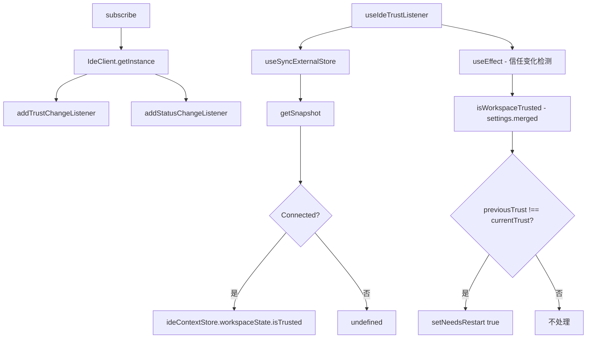

# useIdeTrustListener.ts

> 监听 IDE 伴侣扩展的信任状态变化，判断是否需要重启 CLI

## 概述

`useIdeTrustListener` 是一个 React Hook，用于与 IDE 伴侣扩展（如 VS Code 扩展）的信任系统集成。它通过 `IdeClient` 监听两种变化：

1. **连接状态变化**：IDE 连接/断开时更新状态。
2. **信任状态变化**：IDE 工作区信任级别改变时通知。

当 CLI 的整体信任状态（综合 IDE 信任和文件级信任）发生变化时，设置 `needsRestart` 标志。

## 架构图（mermaid）

## 主要导出

| 导出名 | 类型 | 说明 |
|--------|------|------|
| `RestartReason` | `type` | `'NONE' \| 'CONNECTION_CHANGE' \| 'TRUST_CHANGE'` |
| `useIdeTrustListener` | `() => { isIdeTrusted, needsRestart, restartReason }` | 返回 IDE 信任状态和重启信息 |

## 核心逻辑

1. `useSyncExternalStore` 订阅 IDE 信任状态：
   - `subscribe` 函数异步获取 `IdeClient` 实例，注册连接和信任变化监听器。
   - `getSnapshot` 在连接状态下返回 `ideContextStore.get()?.workspaceState?.isTrusted`。
2. `useEffect` 监听 `isIdeTrusted` 和 `settings.merged` 的变化：
   - 调用 `isWorkspaceTrusted(settings.merged)` 获取综合信任状态。
   - 通过 `previousTrust` ref 对比前后状态，仅在非首次加载时触发 `needsRestart`。

## 内部依赖

| 依赖 | 路径 | 说明 |
|------|------|------|
| `useSettings` | `../contexts/SettingsContext.js` | 获取设置上下文 |
| `isWorkspaceTrusted` | `../../config/trustedFolders.js` | 综合信任判断 |

## 外部依赖

| 依赖 | 说明 |
|------|------|
| `react` | `useCallback`, `useEffect`, `useState`, `useSyncExternalStore`, `useRef` |
| `@google/gemini-cli-core` | `IdeClient`, `IDEConnectionStatus`, `ideContextStore`, `IDEConnectionState` |
