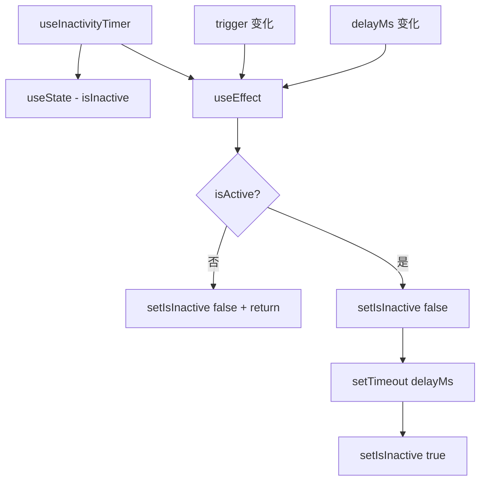

# useInactivityTimer.ts

> 在指定延迟内无触发变化时返回 true，用于检测不活跃状态

## 概述

`useInactivityTimer` 是一个通用的 React Hook，实现了不活跃检测逻辑。它在 `trigger` 值停止变化后等待 `delayMs` 毫秒，然后返回 `true`。每当 `trigger` 变化或 `isActive` 变为 false 时，计时器重置。

这是一个基础的定时器 Hook，被多个更高层 Hook（如 `useShellInactivityStatus`）复用。

## 架构图（mermaid）

## 主要导出

| 导出名 | 类型 | 说明 |
|--------|------|------|
| `useInactivityTimer` | `(isActive: boolean, trigger: unknown, delayMs?: number) => boolean` | 返回是否处于不活跃状态 |

## 核心逻辑

1. 每当 `isActive`、`trigger` 或 `delayMs` 变化时，`useEffect` 重新执行。
2. 不活跃时（`isActive` 为 false），立即重置为非不活跃状态。
3. 活跃时，先重置为 `false`，然后设置 `setTimeout`，到期后设为 `true`。
4. `useEffect` 的清理函数 `clearTimeout` 确保旧定时器被正确取消。
5. 默认 `delayMs` 为 5000ms。

## 内部依赖

无。

## 外部依赖

| 依赖 | 说明 |
|------|------|
| `react` | `useState`, `useEffect` |
