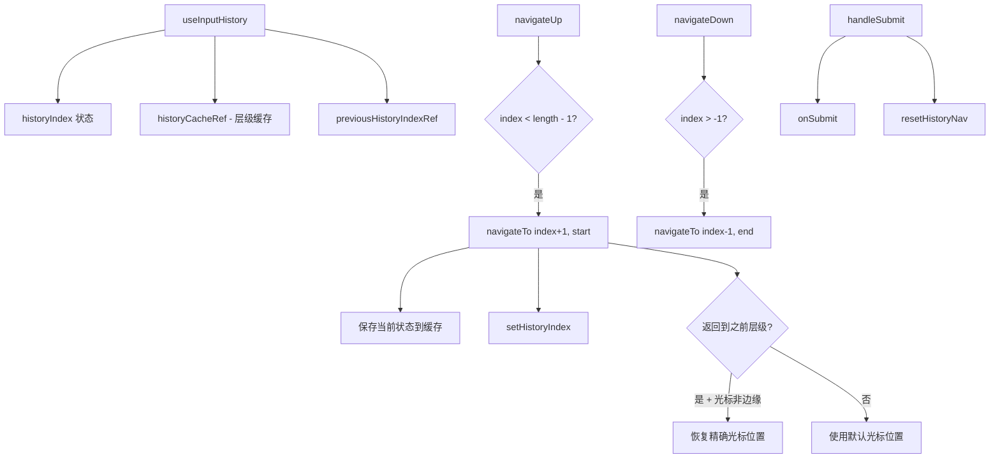

# useInputHistory.ts

> 提供输入框的历史记录导航功能，支持上下翻阅和光标位置恢复

## 概述

`useInputHistory` 是一个 React Hook，实现了类似终端 Shell 的输入历史导航功能。用户可以通过上/下箭头在历史消息中浏览，并在返回到之前访问过的历史层级时恢复光标位置。

关键设计：
- 使用 `historyIndex` 状态跟踪当前在历史记录中的位置（-1 表示当前输入）。
- 使用 `historyCacheRef` 缓存每个层级的文本和光标偏移量。
- 使用 `previousHistoryIndexRef` 跟踪前一个位置，实现"返回到刚离开的层级"时的智能光标恢复。

## 架构图（mermaid）

## 主要导出

| 导出名 | 类型 | 说明 |
|--------|------|------|
| `UseInputHistoryReturn` | `interface` | `{ handleSubmit, navigateUp, navigateDown }` |
| `useInputHistory` | `(props) => UseInputHistoryReturn` | 返回提交和导航函数 |

## 核心逻辑

1. `navigateTo(nextIndex, defaultCursor)`：
   - 保存当前层级的文本和光标到 `historyCacheRef`。
   - 更新 `historyIndex`。
   - 判断是否为"返回"导航（`nextIndex === -1` 或等于 `previousHistoryIndexRef`）。
   - 返回导航时，如果缓存的光标不在文本首/尾，则精确恢复；否则使用 `defaultCursor`。
2. `navigateUp`：向更旧的历史移动，默认光标在行首。
3. `navigateDown`：向更新的历史移动，默认光标在行尾。
4. `handleSubmit`：提交文本后重置导航状态（清空缓存和索引）。

## 内部依赖

| 依赖 | 路径 | 说明 |
|------|------|------|
| `cpLen` | `../utils/textUtils.js` | Unicode 感知的字符串长度 |

## 外部依赖

| 依赖 | 说明 |
|------|------|
| `react` | `useState`, `useCallback`, `useRef` |
