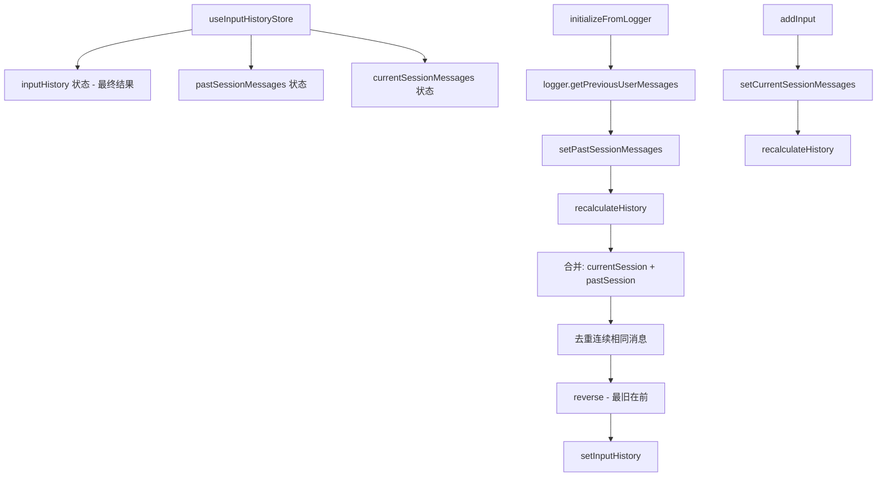

# useInputHistoryStore.ts

> 独立管理输入历史的持久化存储，合并当前会话和历史会话的消息并去重

## 概述

`useInputHistoryStore` 是一个 React Hook，独立于聊天历史（不受 `/clear` 命令影响）管理用户输入的历史记录。它将当前会话的输入和从 Logger 加载的过去会话输入合并、去重后提供给 `useInputHistory` 使用。

关键设计：
- 分离存储当前会话消息和过去会话消息。
- 通过 `recalculateHistory` 统一合并和去重。
- 去重算法：移除连续相同的消息。
- 结果以最旧在前的顺序提供。

## 架构图（mermaid）

## 主要导出

| 导出名 | 类型 | 说明 |
|--------|------|------|
| `UseInputHistoryStoreReturn` | `interface` | `{ inputHistory, addInput, initializeFromLogger }` |
| `useInputHistoryStore` | `() => UseInputHistoryStoreReturn` | 返回历史列表和操作函数 |

## 核心逻辑

1. `initializeFromLogger`：仅执行一次（通过 `isInitialized` 标志），从 Logger 获取过去会话的用户消息。
2. `recalculateHistory`：合并当前会话（最新在前）和过去会话（最新在前），去除连续重复后反转为最旧在前。
3. `addInput`：添加修剪后的非空输入到当前会话数组，触发重新计算。
4. `addInput` 使用嵌套的 `setState` 回调获取最新的 `pastSessionMessages`，避免闭包陈旧。

## 内部依赖

无。

## 外部依赖

| 依赖 | 说明 |
|------|------|
| `react` | `useState`, `useCallback` |
| `@google/gemini-cli-core` | `debugLogger` |
