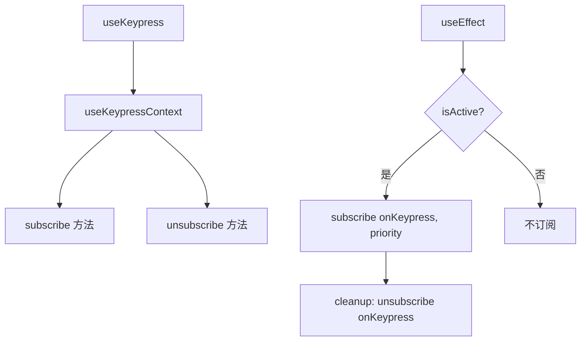

# useKeypress.ts

> 订阅键盘按压事件的核心 Hook，支持优先级和活跃状态控制

## 概述

`useKeypress` 是 Gemini CLI UI 中键盘事件处理的基础 Hook。它通过 `KeypressContext` 上下文进行事件订阅/取消订阅，支持优先级机制（用于对话框覆盖普通输入等场景）。

几乎所有需要响应键盘输入的 Hook 都依赖此 Hook。

## 架构图（mermaid）

## 主要导出

| 导出名 | 类型 | 说明 |
|--------|------|------|
| `Key` | `type` (re-export) | 按键事件类型 |
| `useKeypress` | `(onKeypress, { isActive, priority? }) => void` | 键盘监听 Hook |

## 核心逻辑

1. 通过 `useKeypressContext()` 获取 `subscribe` 和 `unsubscribe` 方法。
2. `useEffect` 在 `isActive` 为 true 时调用 `subscribe(onKeypress, priority)`。
3. cleanup 函数调用 `unsubscribe(onKeypress)` 移除订阅。
4. 依赖数组包含 `isActive`, `onKeypress`, `subscribe`, `unsubscribe`, `priority`。

## 内部依赖

| 依赖 | 路径 | 说明 |
|------|------|------|
| `useKeypressContext` | `../contexts/KeypressContext.js` | 键盘事件上下文 |
| `KeypressHandler`, `Key`, `KeypressPriority` | `../contexts/KeypressContext.js` | 类型定义 |

## 外部依赖

| 依赖 | 说明 |
|------|------|
| `react` | `useEffect` |
