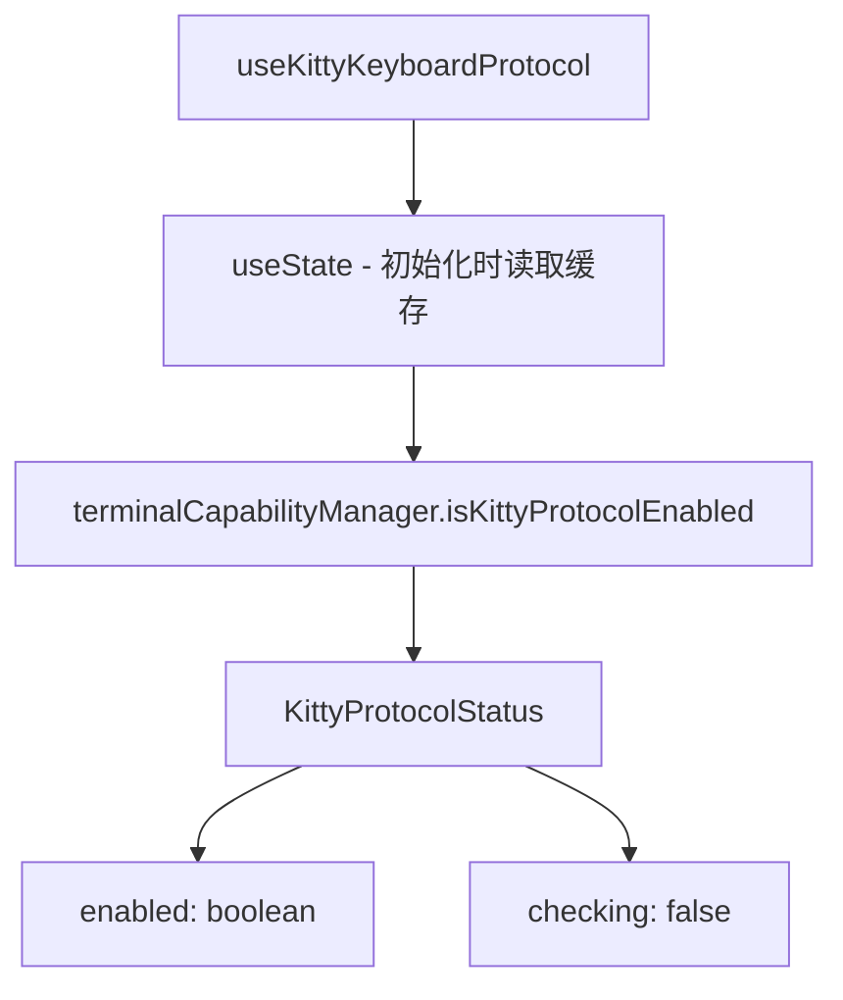

# useKittyKeyboardProtocol.ts

> 返回 Kitty 键盘协议的缓存检测状态

## 概述

`useKittyKeyboardProtocol` 是一个简单的 React Hook，返回终端是否支持 Kitty 键盘协议。检测在应用启动时一次性完成（由 `terminalCapabilityManager` 管理），此 Hook 仅读取缓存结果。

Kitty 键盘协议提供更丰富的键盘事件信息（如区分修饰键按下/释放），启用后可支持更精确的快捷键处理。

## 架构图（mermaid）

## 主要导出

| 导出名 | 类型 | 说明 |
|--------|------|------|
| `KittyProtocolStatus` | `interface` | `{ enabled: boolean, checking: boolean }` |
| `useKittyKeyboardProtocol` | `() => KittyProtocolStatus` | 返回协议状态 |

## 核心逻辑

1. 使用 `useState` 初始化时调用 `terminalCapabilityManager.isKittyProtocolEnabled()` 读取缓存的检测结果。
2. `checking` 始终为 `false`，因为检测在 Hook 创建前已完成。
3. 状态不会更新（没有 `useEffect`），是一个纯读取 Hook。

## 内部依赖

| 依赖 | 路径 | 说明 |
|------|------|------|
| `terminalCapabilityManager` | `../utils/terminalCapabilityManager.js` | 终端能力管理器 |

## 外部依赖

| 依赖 | 说明 |
|------|------|
| `react` | `useState` |
