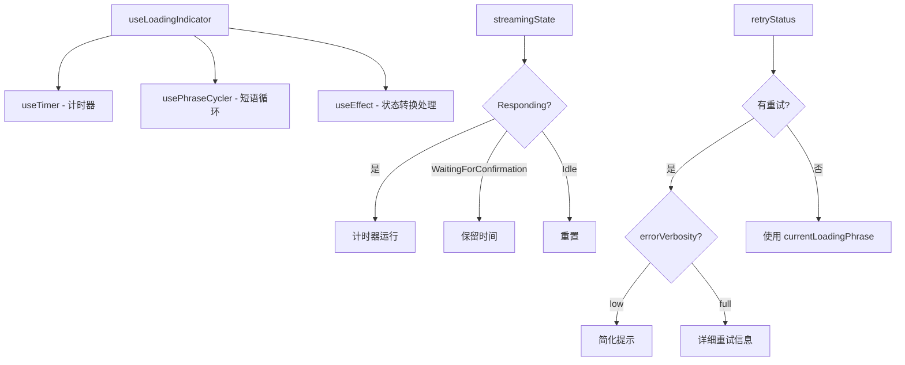

# useLoadingIndicator.ts

> 组合计时器和短语循环器，为加载指示器提供已用时间和当前显示短语

## 概述

`useLoadingIndicator` 是一个组合型 React Hook，将 `useTimer` 和 `usePhraseCycler` 的输出整合为加载指示器所需的数据。它处理：

1. **计时**：在 `Responding` 状态下运行计时器，在 `WaitingForConfirmation` 时保留最后时间。
2. **短语**：根据流式状态和配置显示不同的加载提示短语。
3. **重试**：当存在重试状态时，根据 `errorVerbosity` 显示重试信息或简化提示。
4. **状态转换**：正确处理 Responding -> WaitingForConfirmation -> Responding 的转换。

## 架构图（mermaid）

## 主要导出

| 导出名 | 类型 | 说明 |
|--------|------|------|
| `UseLoadingIndicatorProps` | `interface` | Hook 参数 |
| `useLoadingIndicator` | `(props) => { elapsedTime, currentLoadingPhrase }` | 返回已用时间和显示短语 |

## 核心逻辑

1. **计时器管理**：`timerResetKey` 驱动 `useTimer` 重置。从 WaitingForConfirmation 返回 Responding 时重置；从 Responding 变为 Idle 时重置。
2. **时间保留**：进入 WaitingForConfirmation 时将 `elapsedTimeFromTimer` 保存到 `retainedElapsedTime`，输出时使用保留值。
3. **重试短语**：`retryPhrase` 在低详细度模式下仅在超过 2 次重试后显示简化提示；完整模式显示详细的模型和尝试次数。
4. `retryPhrase` 优先级高于 `currentLoadingPhrase`。

## 内部依赖

| 依赖 | 路径 | 说明 |
|------|------|------|
| `StreamingState` | `../types.js` | 流式状态枚举 |
| `useTimer` | `./useTimer.js` | 计时器 Hook |
| `usePhraseCycler` | `./usePhraseCycler.js` | 短语循环 Hook |
| `LoadingPhrasesMode` | `../../config/settings.js` | 短语模式类型 |

## 外部依赖

| 依赖 | 说明 |
|------|------|
| `react` | `useState`, `useEffect`, `useRef` |
| `@google/gemini-cli-core` | `getDisplayString`, `RetryAttemptPayload` |
