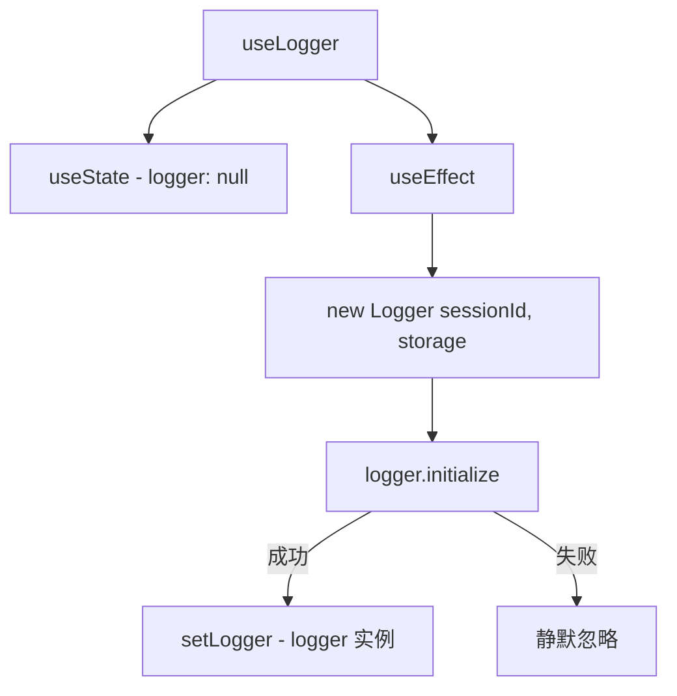

# useLogger.ts

> 异步初始化 Logger 实例并通过状态暴露给组件

## 概述

`useLogger` 是一个 React Hook，负责创建和初始化 `Logger` 实例。Logger 用于记录聊天会话消息并支持历史记录加载。

初始化是异步的，但不使用 `await` 阻塞 --这是一个有意的设计决策，避免延迟 CLI 启动时的 prompt 显示。在 Logger 初始化完成前，返回 `null`。

## 架构图（mermaid）

## 主要导出

| 导出名 | 类型 | 说明 |
|--------|------|------|
| `useLogger` | `(storage: Storage) => Logger \| null` | 返回 Logger 实例或 null |

## 核心逻辑

1. 在 `useEffect` 中创建 `new Logger(sessionId, storage)`。
2. 调用 `logger.initialize()` 异步初始化（不阻塞）。
3. 初始化成功后 `setLogger(newLogger)` 使实例可用。
4. 初始化失败时静默忽略（`.catch(() => {})`），不影响 CLI 正常使用。
5. 依赖 `storage` --storage 变化时重新创建 Logger。

## 内部依赖

无。

## 外部依赖

| 依赖 | 说明 |
|------|------|
| `react` | `useState`, `useEffect` |
| `@google/gemini-cli-core` | `sessionId`, `Logger`, `Storage` |
