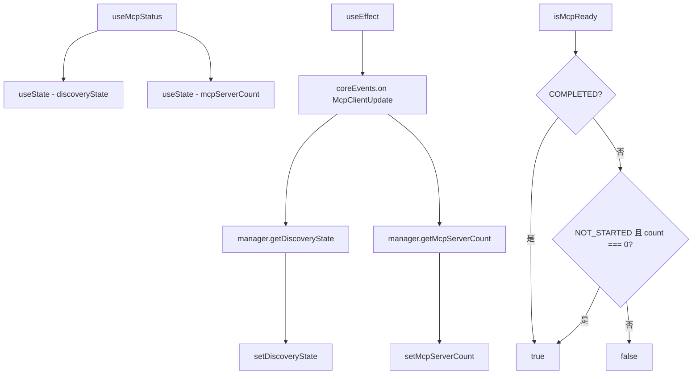

# useMcpStatus.ts

> 跟踪 MCP（Model Context Protocol）服务器的发现状态和数量

## 概述

`useMcpStatus` 是一个 React Hook，监控 MCP 客户端管理器的状态。MCP 服务器提供额外的工具和资源给 Gemini CLI，其发现过程是异步的。该 Hook 提供：

1. 当前发现状态（NOT_STARTED / IN_PROGRESS / COMPLETED）。
2. 已发现的 MCP 服务器数量。
3. `isMcpReady` 派生状态，用于判断是否可以安全地开始处理用户消息。

## 架构图（mermaid）

## 主要导出

| 导出名 | 类型 | 说明 |
|--------|------|------|
| `useMcpStatus` | `(config: Config) => { discoveryState, mcpServerCount, isMcpReady }` | 返回 MCP 状态信息 |

## 核心逻辑

1. 初始状态从 `config.getMcpClientManager()` 同步获取。
2. 监听 `CoreEvent.McpClientUpdate` 事件，每次触发时从管理器重新读取状态。
3. `isMcpReady` 在两种情况下为 true：
   - 发现已完成（`COMPLETED`）。
   - 发现未开始且无服务器配置（`NOT_STARTED && mcpServerCount === 0`）。

## 内部依赖

无。

## 外部依赖

| 依赖 | 说明 |
|------|------|
| `react` | `useEffect`, `useState` |
| `@google/gemini-cli-core` | `Config`, `coreEvents`, `MCPDiscoveryState`, `CoreEvent` |
