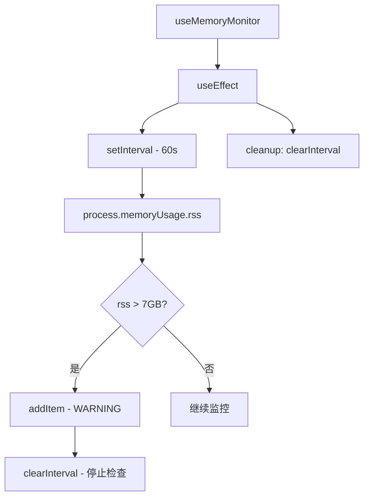

# useMemoryMonitor.ts

> 定期检查进程内存使用量，超过 7GB 阈值时显示警告

## 概述

`useMemoryMonitor` 是一个 React Hook，以 1 分钟间隔监控 Node.js 进程的 RSS（Resident Set Size）内存使用量。当内存超过 7GB 阈值时，向用户显示警告消息并停止后续检查。

该 Hook 主要用于在长时间会话中提前检测潜在的内存泄漏或异常内存增长。

## 架构图（mermaid）

## 主要导出

| 导出名 | 类型 | 说明 |
|--------|------|------|
| `MEMORY_WARNING_THRESHOLD` | `number` | 7GB（字节） |
| `MEMORY_CHECK_INTERVAL` | `number` | 60000ms（1 分钟） |
| `useMemoryMonitor` | `({ addItem }) => void` | 内存监控 Hook |

## 核心逻辑

1. `useEffect` 创建 `setInterval`，每 60 秒检查一次 `process.memoryUsage().rss`。
2. 超过 7GB 时通过 `addItem` 添加 WARNING 类型消息，包含当前使用量（GB）和 `/bug` 命令提示。
3. 警告触发后立即 `clearInterval` 停止监控（避免重复警告）。
4. 组件卸载时清理定时器。

## 内部依赖

| 依赖 | 路径 | 说明 |
|------|------|------|
| `HistoryItemWithoutId`, `MessageType` | `../types.js` | 消息类型 |

## 外部依赖

| 依赖 | 说明 |
|------|------|
| `react` | `useEffect` |
| `node:process` | `process.memoryUsage()` |
