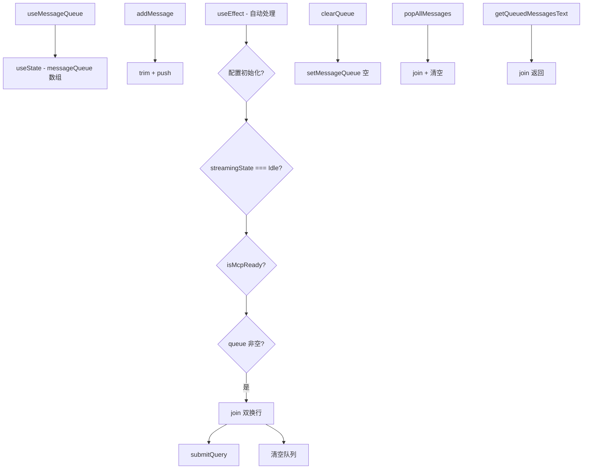

# useMessageQueue.ts

> 在 AI 响应期间排队用户消息，空闲时自动合并发送

## 概述

`useMessageQueue` 是一个 React Hook，解决用户在 AI 响应过程中想要追加消息的场景。当 `streamingState` 不是 `Idle` 时，用户提交的消息会被加入队列；当流式响应完成且 MCP 准备就绪时，所有排队的消息自动合并（以双换行连接）并一次性提交。

## 架构图（mermaid）

## 主要导出

| 导出名 | 类型 | 说明 |
|--------|------|------|
| `UseMessageQueueOptions` | `interface` | Hook 参数 |
| `UseMessageQueueReturn` | `interface` | `{ messageQueue, addMessage, clearQueue, getQueuedMessagesText, popAllMessages }` |
| `useMessageQueue` | `(options) => UseMessageQueueReturn` | 返回队列状态和操作函数 |

## 核心逻辑

1. `addMessage`：修剪空白后加入队列。
2. `useEffect` 监听四个条件：`isConfigInitialized`、`streamingState === Idle`、`isMcpReady`、`messageQueue.length > 0`。
3. 所有条件满足时，合并所有消息为单个字符串（双换行分隔）并调用 `submitQuery`。
4. `popAllMessages`：手动取出所有消息并清空队列，返回合并的字符串。
5. `getQueuedMessagesText`：只读获取排队消息的文本，不清空队列。

## 内部依赖

| 依赖 | 路径 | 说明 |
|------|------|------|
| `StreamingState` | `../types.js` | 流式状态枚举 |

## 外部依赖

| 依赖 | 说明 |
|------|------|
| `react` | `useCallback`, `useEffect`, `useState` |
