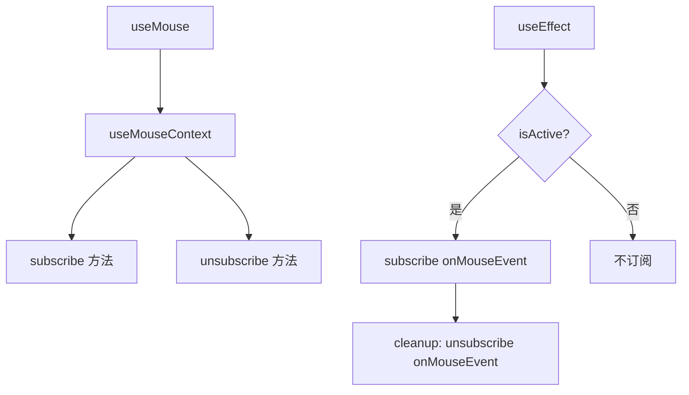

# useMouse.ts

> 订阅鼠标事件的核心 Hook，支持活跃状态控制

## 概述

`useMouse` 是 Gemini CLI UI 中鼠标事件处理的基础 Hook，与 `useKeypress` 类似的模式。它通过 `MouseContext` 上下文进行事件订阅/取消订阅，在 `isActive` 为 true 时监听鼠标事件。

## 架构图（mermaid）

## 主要导出

| 导出名 | 类型 | 说明 |
|--------|------|------|
| `MouseEvent` | `type` (re-export) | 鼠标事件类型 |
| `useMouse` | `(onMouseEvent, { isActive }) => void` | 鼠标监听 Hook |

## 核心逻辑

1. 通过 `useMouseContext()` 获取 `subscribe` 和 `unsubscribe` 方法。
2. `useEffect` 在 `isActive` 为 true 时订阅，cleanup 时取消订阅。
3. 依赖数组包含 `isActive`, `onMouseEvent`, `subscribe`, `unsubscribe`。

## 内部依赖

| 依赖 | 路径 | 说明 |
|------|------|------|
| `useMouseContext` | `../contexts/MouseContext.js` | 鼠标事件上下文 |
| `MouseHandler`, `MouseEvent` | `../contexts/MouseContext.js` | 类型定义 |

## 外部依赖

| 依赖 | 说明 |
|------|------|
| `react` | `useEffect` |
