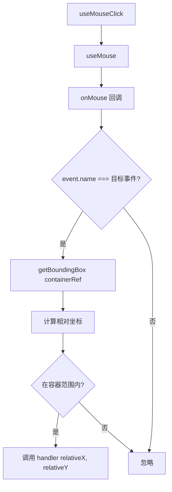

# useMouseClick.ts

> 在指定容器内检测鼠标点击事件，计算相对坐标

## 概述

`useMouseClick` 是一个 React Hook，在 `useMouse` 基础上添加了容器级别的点击检测。它通过 Ink 的 `getBoundingBox` API 获取容器的布局位置，将终端全局的鼠标坐标转换为容器内的相对坐标，仅在点击位置在容器范围内时触发回调。

支持配置左键/右键和自定义事件名称。

## 架构图（mermaid）

## 主要导出

| 导出名 | 类型 | 说明 |
|--------|------|------|
| `useMouseClick` | `(containerRef, handler, options?) => void` | 容器内点击检测 Hook |

## 核心逻辑

1. 根据 `button` 选项确定目标事件名：左键为 `left-press`，右键为 `right-release`。可通过 `name` 选项自定义。
2. 终端鼠标事件坐标是 1-based，Ink 布局是 0-based，转换为 `mouseX = event.col - 1`, `mouseY = event.row - 1`。
3. 相对坐标：`relativeX = mouseX - x`, `relativeY = mouseY - y`。
4. 边界检查：`relativeX >= 0 && relativeX < width && relativeY >= 0 && relativeY < height`。
5. `handlerRef` 通过 ref 避免闭包陈旧问题。

## 内部依赖

| 依赖 | 路径 | 说明 |
|------|------|------|
| `useMouse` | `../contexts/MouseContext.js` | 直接从 context 导入（非当前目录的 useMouse.ts） |

## 外部依赖

| 依赖 | 说明 |
|------|------|
| `react` | `useCallback`, `useRef` |
| `ink` | `getBoundingBox`, `DOMElement` |
