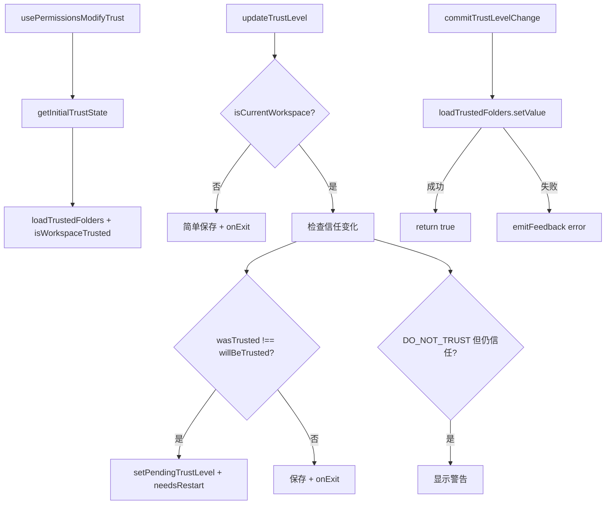

# usePermissionsModifyTrust.ts

> 在权限管理界面中修改文件夹信任级别，处理继承信任和重启逻辑

## 概述

`usePermissionsModifyTrust` 是一个 React Hook，为 `/permissions` 命令的信任修改界面提供状态管理。它处理以下复杂场景：

1. 检测当前信任级别（显式设置 vs 从父文件夹继承 vs 从 IDE 继承）。
2. 修改信任级别时的持久化。
3. 当信任状态变化需要重启时的确认流程。
4. 对非当前工作区目录的简化处理。
5. 设置 DO_NOT_TRUST 但仍因 IDE/父级而信任时的警告消息。

## 架构图（mermaid）

## 主要导出

| 导出名 | 类型 | 说明 |
|--------|------|------|
| `usePermissionsModifyTrust` | `(onExit, addItem, targetDirectory) => { cwd, currentTrustLevel, isInheritedTrustFromParent, isInheritedTrustFromIde, needsRestart, updateTrustLevel, commitTrustLevelChange, isFolderTrustEnabled }` | 返回信任状态和操作函数 |

## 核心逻辑

1. **初始状态计算**（`getInitialTrustState`）：
   - 获取目标目录的显式信任级别。
   - 对当前工作区，调用 `isWorkspaceTrusted` 获取综合信任状态和来源（file/ide）。
   - 判断信任是否为继承（trusted 但无显式设置或显式为 DO_NOT_TRUST）。
2. **updateTrustLevel**：
   - 非当前工作区：直接保存并退出。
   - 当前工作区：创建临时配置检查新信任状态，对比变化前后决定是否需要重启。
3. **commitTrustLevelChange**：在重启确认后执行实际的持久化写入。
4. 路径比较使用 `path.resolve().toLowerCase()` 处理大小写不敏感的文件系统。

## 内部依赖

| 依赖 | 路径 | 说明 |
|------|------|------|
| `loadTrustedFolders`, `TrustLevel`, `isWorkspaceTrusted` | `../../config/trustedFolders.js` | 信任管理 |
| `useSettings` | `../contexts/SettingsContext.js` | 设置上下文 |
| `MessageType` | `../types.js` | 消息类型 |
| `UseHistoryManagerReturn` | `./useHistoryManager.js` | addItem 类型 |
| `LoadedSettings` | `../../config/settings.js` | 设置类型 |

## 外部依赖

| 依赖 | 说明 |
|------|------|
| `react` | `useState`, `useCallback` |
| `node:process` | `process.cwd()` |
| `node:path` | `path.resolve()` |
| `@google/gemini-cli-core` | `coreEvents` |
