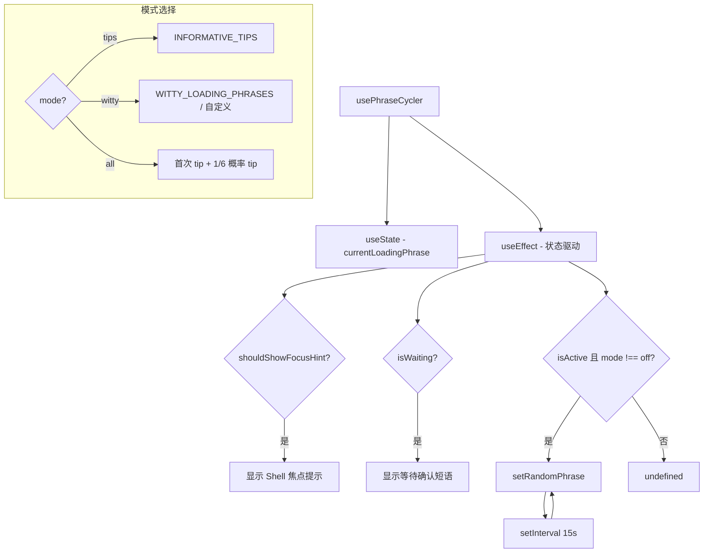

# usePhraseCycler.ts

> 定时循环显示加载提示短语，支持 tips / witty / all / off 四种模式

## 概述

`usePhraseCycler` 是一个 React Hook，在 AI 响应期间定时（每 15 秒）切换显示的加载提示短语。支持四种模式：

- **tips**：仅显示信息性提示（快捷键、功能说明等）。
- **witty**：仅显示诙谐短语。
- **all**：混合模式，首次请求显示 tip，之后 1/6 概率显示 tip，其余为诙谐短语。
- **off**：不显示任何短语。

还处理两种特殊状态：等待用户确认和 Shell 焦点提示。

## 架构图（mermaid）

## 主要导出

| 导出名 | 类型 | 说明 |
|--------|------|------|
| `PHRASE_CHANGE_INTERVAL_MS` | `number` | 15000ms |
| `INTERACTIVE_SHELL_WAITING_PHRASE` | `string` | Shell 焦点提示文本 |
| `usePhraseCycler` | `(isActive, isWaiting, shouldShowFocusHint, loadingPhrasesMode?, customPhrases?) => string \| undefined` | 返回当前短语 |

## 核心逻辑

1. 优先级：`shouldShowFocusHint` > `isWaiting` > `isActive` + mode。
2. `setRandomPhrase` 根据 mode 选择短语列表，然后随机选取。
3. `all` 模式使用 `hasShownFirstRequestTipRef` 确保首次请求必定显示 tip。
4. 支持 `customPhrases` 替代内置的 `WITTY_LOADING_PHRASES`。
5. `useEffect` 清理函数正确清除 `setInterval`。

## 内部依赖

| 依赖 | 路径 | 说明 |
|------|------|------|
| `INFORMATIVE_TIPS` | `../constants/tips.js` | 信息性提示列表 |
| `WITTY_LOADING_PHRASES` | `../constants/wittyPhrases.js` | 诙谐短语列表 |
| `LoadingPhrasesMode` | `../../config/settings.js` | 短语模式类型 |

## 外部依赖

| 依赖 | 说明 |
|------|------|
| `react` | `useState`, `useEffect`, `useRef` |
