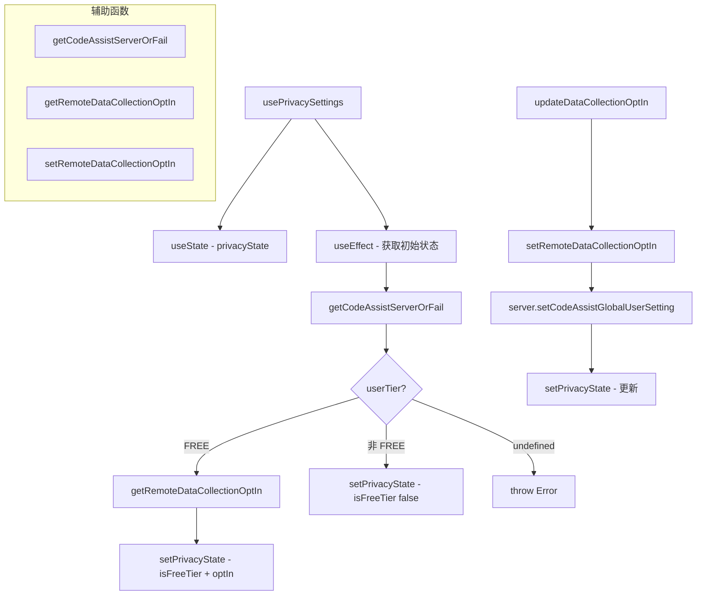

# usePrivacySettings.ts

> 管理免费用户的数据收集隐私选项，与 Code Assist API 交互

## 概述

`usePrivacySettings` 是一个 React Hook，管理用户的隐私设置。主要用于免费用户（Free Tier）的数据收集选择（opt-in/opt-out）。它与 Google Code Assist 后端 API 交互，获取和更新用户的 `freeTierDataCollectionOptin` 设置。

对于非免费用户，数据收集策略由其他方式管理，此 Hook 仅返回 `isFreeTier: false`。

## 架构图（mermaid）

## 主要导出

| 导出名 | 类型 | 说明 |
|--------|------|------|
| `PrivacyState` | `interface` | `{ isLoading, error?, isFreeTier?, dataCollectionOptIn? }` |
| `usePrivacySettings` | `(config: Config) => { privacyState, updateDataCollectionOptIn }` | 返回状态和更新函数 |

## 核心逻辑

1. 初始化时检查 `CodeAssistServer` 是否可用（需要 OAuth 认证和 projectId）。
2. 获取用户等级（`userTier`），非免费用户直接返回。
3. 免费用户调用 `server.getCodeAssistGlobalUserSetting()` 获取当前 opt-in 状态。
4. 404 响应视为默认 opt-in（true），其他错误向上抛出。
5. `updateDataCollectionOptIn` 调用 `server.setCodeAssistGlobalUserSetting()` 更新设置。

## 内部依赖

无。

## 外部依赖

| 依赖 | 说明 |
|------|------|
| `react` | `useState`, `useEffect`, `useCallback` |
| `@google/gemini-cli-core` | `Config`, `CodeAssistServer`, `UserTierId`, `getCodeAssistServer`, `debugLogger` |
