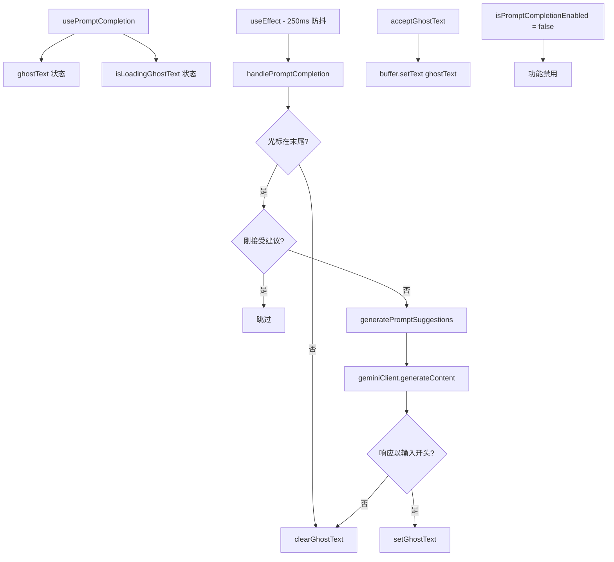

# usePromptCompletion.ts

> 使用 AI 模型为用户输入生成提示补全建议（Ghost Text），当前功能已禁用

## 概述

`usePromptCompletion` 是一个 React Hook，旨在为用户输入提供 AI 驱动的提示补全（类似 GitHub Copilot 的 Ghost Text）。当用户输入超过 5 个字符时，它会通过 Gemini API 生成补全建议，以半透明文本显示。

**注意**：当前 `isPromptCompletionEnabled` 硬编码为 `false`，功能已禁用。代码完整但不会执行 API 调用。

主要特性（设计时）：
- 250ms 防抖延迟
- 最小 5 字符触发
- 排除 Slash 命令和 @ 引用
- 光标必须在文本末尾
- 支持接受（apply）和清除操作
- 请求取消（AbortController）

## 架构图（mermaid）

## 主要导出

| 导出名 | 类型 | 说明 |
|--------|------|------|
| `PROMPT_COMPLETION_MIN_LENGTH` | `number` | 5 |
| `PROMPT_COMPLETION_DEBOUNCE_MS` | `number` | 250 |
| `PromptCompletion` | `interface` | `{ text, isLoading, isActive, accept, clear, markSelected }` |
| `UsePromptCompletionOptions` | `interface` | `{ buffer, config }` |
| `usePromptCompletion` | `(options) => PromptCompletion` | 返回补全状态和操作函数 |

## 核心逻辑

1. **生成建议**：构建 prompt 要求 AI 从用户输入文本开始续写，然后验证响应确实以输入文本开头。
2. **防抖**：`useEffect` 使用 `setTimeout(250ms)` 延迟触发 `handlePromptCompletion`。
3. **验证**：另一个 `useEffect` 持续检查 ghostText 是否仍与当前文本匹配，不匹配则清除。
4. **接受**：`acceptGhostText` 将 ghostText 设置为 buffer 的文本，并标记为刚选择建议。
5. **markSelected**：供外部（如 @ 补全）标记已选择建议，避免触发新的补全。

## 内部依赖

| 依赖 | 路径 | 说明 |
|------|------|------|
| `TextBuffer` | `../components/shared/text-buffer.js` | 文本缓冲区类型 |
| `isSlashCommand` | `../utils/commandUtils.js` | Slash 命令判断 |

## 外部依赖

| 依赖 | 说明 |
|------|------|
| `react` | `useState`, `useCallback`, `useRef`, `useEffect`, `useMemo` |
| `@google/gemini-cli-core` | `debugLogger`, `getResponseText`, `LlmRole`, `Config` |
| `@google/genai` | `Content` 类型 |
