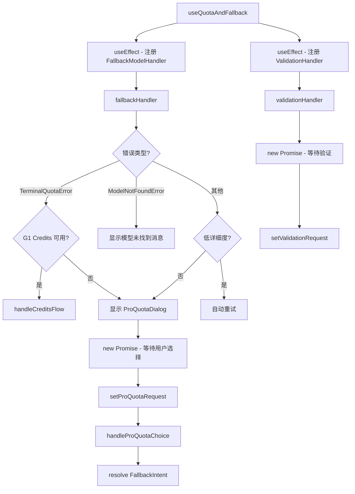

# useQuotaAndFallback.ts

> 处理模型配额耗尽时的降级策略，管理多种对话框（Pro 配额 / 验证 / 超额 / 空钱包）

## 概述

`useQuotaAndFallback` 是一个复杂的 React Hook，处理当 Gemini 模型达到使用限制或需要验证时的用户交互流程。它管理四种对话框：

1. **ProQuotaDialog**：模型配额耗尽时显示，提供切换模型、重试或使用降级模型等选项。
2. **ValidationDialog**：403 VALIDATION_REQUIRED 错误时显示，引导用户完成验证。
3. **OverageMenuDialog**：G1 AI Credits 超额时的选择菜单。
4. **EmptyWalletDialog**：AI Credits 余额为零时的提示。

核心机制是通过 `config.setFallbackModelHandler` 和 `config.setValidationHandler` 注册处理器，在错误发生时通过 Promise 暂停执行直到用户做出选择。

## 架构图（mermaid）

## 主要导出

| 导出名 | 类型 | 说明 |
|--------|------|------|
| `useQuotaAndFallback` | `(args) => { proQuotaRequest, handleProQuotaChoice, validationRequest, handleValidationChoice, overageMenuRequest, handleOverageMenuChoice, emptyWalletRequest, handleEmptyWalletChoice }` | 返回所有对话框请求和处理函数 |

## 核心逻辑

1. **FallbackModelHandler**：
   - `TerminalQuotaError`：构建含重置时间的消息，Pro 模型显示为"all Pro models"。
   - G1 Credits 流程：有可用余额且模型支持超额时，委托给 `handleCreditsFlow`。
   - `ModelNotFoundError`：区分已知模型（管理员禁用提示）和未知模型。
   - 低详细度模式下，非终端性错误自动 `retry_once`。
2. **Promise 模式**：通过 `new Promise<FallbackIntent>((resolve) => { setRequest({...resolve}) })` 暂停执行。
3. **isDialogPending** ref 防止并发对话框。
4. `handleProQuotaChoice`：处理 `retry_always`（切换降级模型）和 `retry_once`（重试当前模型）。
5. **getResetTimeMessage**：使用 `Intl.DateTimeFormat` 格式化重置时间。

## 内部依赖

| 依赖 | 路径 | 说明 |
|------|------|------|
| `UseHistoryManagerReturn` | `./useHistoryManager.js` | 历史管理器类型 |
| `MessageType` | `../types.js` | 消息类型 |
| `ProQuotaDialogRequest`, `ValidationDialogRequest` 等 | `../contexts/UIStateContext.js` | 对话框请求类型 |
| `LoadedSettings` | `../../config/settings.js` | 设置类型 |
| `handleCreditsFlow` | `./creditsFlowHandler.js` | G1 Credits 处理逻辑 |

## 外部依赖

| 依赖 | 说明 |
|------|------|
| `react` | `useCallback`, `useEffect`, `useRef`, `useState` |
| `@google/gemini-cli-core` | `AuthType`, `Config`, `TerminalQuotaError`, `ModelNotFoundError`, `VALID_GEMINI_MODELS`, `isProModel`, `isOverageEligibleModel`, `getDisplayString`, 等 |
