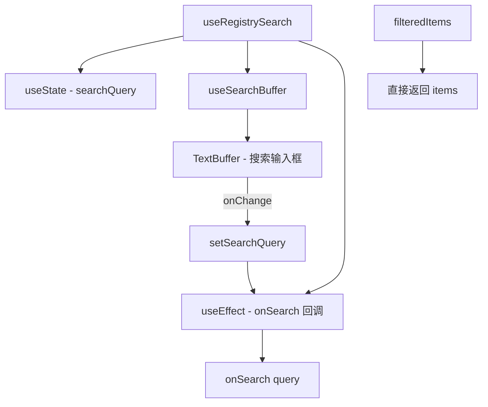

# useRegistrySearch.ts

> 为注册表列表（扩展、设置等）提供搜索过滤和文本缓冲区管理

## 概述

`useRegistrySearch` 是一个泛型 React Hook，为可搜索列表组件提供搜索功能。它将搜索查询状态、搜索缓冲区（TextBuffer）和过滤逻辑组合在一起。当前实现中，过滤逻辑委托给外部（`filteredItems` 直接返回原始 `items`），搜索查询通过 `onSearch` 回调传递给外部处理。

## 架构图（mermaid）

## 主要导出

| 导出名 | 类型 | 说明 |
|--------|------|------|
| `UseRegistrySearchResult<T>` | `interface` | `{ filteredItems, searchBuffer, searchQuery, setSearchQuery, maxLabelWidth }` |
| `useRegistrySearch` | `<T>(props) => UseRegistrySearchResult<T>` | 泛型搜索 Hook |

## 核心逻辑

1. `searchQuery` 状态由 `useSearchBuffer` 的 `onChange` 回调驱动。
2. `useEffect` 在 `searchQuery` 变化时（跳过首次渲染）调用 `onSearch` 回调。
3. `onSearchRef` 使用 ref 避免将 `onSearch` 加入依赖数组。
4. `isFirstRender` ref 防止初始加载时触发 `onSearch`。
5. 当前 `filteredItems` 和 `maxLabelWidth` 为占位实现（直接返回 items 和 0）。

## 内部依赖

| 依赖 | 路径 | 说明 |
|------|------|------|
| `TextBuffer` | `../components/shared/text-buffer.js` | 文本缓冲区类型 |
| `GenericListItem` | `../components/shared/SearchableList.js` | 列表项基础类型 |
| `useSearchBuffer` | `./useSearchBuffer.js` | 搜索缓冲区 Hook |

## 外部依赖

| 依赖 | 说明 |
|------|------|
| `react` | `useState`, `useEffect`, `useRef` |
